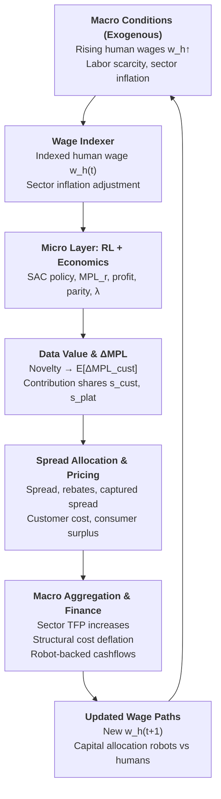

# Economic Architecture

## Core Principle

**Robots compete in labor markets, not benchmarks.**

Traditional robotics optimizes for task completion. This project optimizes for **economic viability**: robots must converge to wage parity with humans doing the same task, and data must have quantifiable economic value.

## Why Economics First?

### 1. Real Success Metric is Wage Parity

A dishwashing robot doesn't "win" by achieving 99% accuracy. It wins by doing $20/hr of work at $15/hr cost.

**Wage parity formula:**
```
ŵᵣ(t) = p · MPᵣ(t) - cₐ · eᵣ(t) · MPᵣ(t)
Parity = ŵᵣ(t) / wₕ
```

Where:
- `p` = price per unit ($/dish)
- `MPᵣ(t)` = robot marginal product (units/hour)
- `eᵣ(t)` = error rate
- `cₐ` = damage cost per error
- `wₕ` = human wage benchmark

**Success:** Parity > 1.0 (robot more valuable than human)

### 2. Data Pricing Requires Causal Attribution

**Question:** What should a customer pay for withholding training data?

**Answer:** The forgone MPL improvement that data would have caused.

**Implementation:**
```
Value_i = E[ΔMPL_i] × p × horizon
where E[ΔMPL_i] = f(novelty_i, causal_gain_i)
```

This requires tracking ΔMPL per datapoint, which drives the entire data economics layer.

### 3. Quality Constraints Need Economic Enforcement

Robot could speed-run tasks with 20% error rate (high MP, useless quality).

**Lagrangian constraint:**
```
r(t) = profit - λ · max(0, eᵣ - e*)
λ ← max(0, λ + η · (eᵣ - e*))
```

- `e*` = error target (6% SLA)
- `λ` = shadow price of quality
- Automatically balances speed vs precision

## The Feasibility Crisis (V1 → V2)

### V1 Problem: Infeasible Task Geometry

- **1D action space** (speed only)
- Error rate stuck at 17-18%, far above 6% SLA
- Wage parity = 0.8 (robot worse than human)
- **Root cause:** Can't achieve SLA while maintaining throughput

### Why This Mattered

**You cannot optimize your way out of infeasible constraints.**

Economics revealed the issue:
- Profit negative
- Parity < 1
- Error rate 3× target

No amount of hyperparameter tuning fixes bad action space design.

### V2 Solution: Controllable Error-Throughput Tradeoff

**2D action space:** `(speed, care)`

**Error model:**
```python
p_err = p_min + k · (speed^q_s) · ((1 - care)^q_c)
# p_err = 0.02 + 0.12 · speed^1.2 · (1-care)^1.5
```

**Throughput penalty:**
```python
rate_per_min *= (1 - care_cost · care)
# care_cost = 0.25
```

**Results:**
- Feasibility sweep: 1,615 viable operating points
- Error dropped to 5-6%
- Wage parity increased to 1.2-1.6
- Profit positive

**Why this design:**
- **Controllability:** Policy can trade speed vs quality
- **Realism:** Matches human behavior (fast OR careful, not both)
- **Economic grounding:** Creates Pareto frontier of MP vs error

## Lagrangian Economics (Why Not Just Reward Shaping?)

### The Problem with Simple Rewards

```python
r = α · MP - β · error  # Can be gamed
```

Policy can:
- Maximize MP, ignore errors
- Minimize errors, sacrifice throughput

### Why Lagrangian

```python
r(t) = profit - λ · max(0, err - e*)
λ ← max(0, λ + η · (err - e*))
```

**Benefits:**
1. **Hard constraint:** Must achieve err ≤ e* (SLA)
2. **Automatic tuning:** λ increases if constraint violated
3. **Economic interpretation:** λ is shadow price of quality
4. **Curriculum:** e* anneals from 10% → 6% over training

**Results (1000 episodes):**
- Final error: 1.8% (well below 6% SLA)
- λ stayed at 0 (constraint never binding after convergence)
- Wage parity: 1.71 (71% premium)

## Mechanistic Spread Allocation

### The Economic Question

When robot wage exceeds human wage (ŵᵣ > wₕ), there's a "spread":
- Customer pays less than they would for human labor
- Platform captures some value for providing the robot
- **How to split this spread?**

### Why NOT Arbitrary Percentages

"Customer gets 60%, platform gets 40%" has no justification:
- No connection to who created the value
- Can't securitize or predict cash flows
- Feels like rent-seeking

### Why Causal Split (ΔMPL-Based)

```python
s_cust = ΔMPL_cust / (ΔMPL_total + ε)
s_plat = 1 - s_cust

rebate = s_cust × (ŵᵣ - wₕ) × hours
captured = s_plat × (ŵᵣ - wₕ) × hours
```

**Logic:**
- If customer's data drove all improvement → s_cust = 1.0 → they get 100% of spread
- If platform's foundation models drove it → s_plat = 1.0 → platform gets 100%
- Typically mixed → s_cust ≈ 35%, s_plat ≈ 65%

**Why this matters:**
1. **Incentive alignment:** Share data → get rebates proportional to contribution
2. **Pricing transparency:** Customers see exactly why they're paying X
3. **Securitization:** Platform can forecast cash flows from s_plat share
4. **Market design:** Creates feedback loop (high-value data → larger rebates → more sharing)

### Results (250 episodes)

- **Episodes with spread:** 247/250 (98.8%)
- **Mean spread value:** $9.11/episode
- **Customer rebate:** $915.58 total (s_cust = 34.94%)
- **Platform captured:** $1,334.31 total (s_plat = 65.06%)
- **Allocation accuracy:** Exact (floating point precision)

## The Training Loop (Economic Architecture)

### Per Episode

1. **Collect trajectory:** Policy interacts with environment
   ```python
   action = policy(obs)  # [speed, care]
   next_obs, info, done = env.step(action)
   ```

2. **Compute economics:**
   ```python
   MPᵣ = completed / hours
   eᵣ = errors / attempts
   ŵᵣ = p · MPᵣ - cₐ · eᵣ · MPᵣ
   profit = revenue - error_cost - energy
   ```

3. **Lagrangian reward:**
   ```python
   reward = profit - λ · max(0, eᵣ - e*)
   ```

4. **SAC update:** Off-policy learning with novelty-weighted replay

5. **Dual update:**
   ```python
   λ ← max(0, λ + η · (eᵣ - e*))
   ```

6. **Spread allocation:**
   ```python
   ΔMPL_total = MPᵣ(t) - MPᵣ(t-1)
   ΔMPL_cust = estimate_from_data_value_model(novelty, ...)
   spread_info = compute_spread_allocation(ŵᵣ, wₕ, hours, ΔMPL_cust, ΔMPL_total)
   ```

7. **Log everything:** MP, error, profit, parity, spread, rebate, captured

### Why This Order

- **Economics drives learning** (reward function)
- **Learning generates economics** (MPL improvement)
- **Spread allocation distributes value** (incentive layer)
- **λ enforces constraints** (quality guarantee)

## Data Value Estimation (The ΔMPL Pipeline)

### Current State (Online Estimator)

```python
# Per episode:
novelty = compute_novelty(state, action, replay_buffer)
ΔMPL_pred = data_value_estimator.predict(novelty)  # Online regression

# After episode:
ΔMPL_actual = MPᵣ(t) - MPᵣ(t-1)
data_value_estimator.update(novelty, ΔMPL_actual)  # Incremental learning
```

**Model:** SGD linear regression or small MLP
**Input:** Novelty features (embedding distance, coverage, etc.)
**Output:** E[ΔMPL_i] (expected MPL improvement)

### Why Online Learning

- **Adaptive:** Model improves as policy evolves
- **No batch delays:** Predictions available immediately
- **Handles distribution shift:** Policy changes → data distribution changes
- **Lightweight:** No offline training loops

### From ΔMPL to Price

```python
# Ex-ante quote
P_noshare = p × κ × E[ΔMPL_i] × horizon × S

where:
  κ = confidence discount (lower_CI / mean)
  S = sharing coefficient (0 = share, 1 = no share)
```

**This gives honest "data → ΔMPL → price" path.**

## Why This Enables Securitization

### Traditional Robotics
- "Our robot can wash dishes!"
- No predictable cash flows
- Revenue depends on licensing deals
- Can't price risk

### This Architecture
- **Predictable cash flows:** `captured = s_plat × spread × hours × deployments`
- **Linear scaling:** More deployments = proportional revenue
- **Customer-aligned:** They profit from contributing data
- **Quantifiable risk:** σ(spread) and σ(s_plat) are measurable

### Example Calculation

**Single robot (1000 hours/year):**
```
Avg spread = $12.74/hr
Avg s_plat = 65%
Captured per robot = 0.65 × $12.74 × 1000 = $8,281/year
```

**1000 robot deployments:**
```
Annual platform revenue = $8,281 × 1000 = $8.28M/year
NPV (5-year, 10% discount) ≈ $31.4M
```

**This is securitizable.**

## Key Design Decisions

### 1. Task Feasibility Before Optimization
- Test action space via feasibility sweep
- Verify SLA is achievable before training
- Don't waste compute on infeasible problems

### 2. Economic Constraints, Not Just Objectives
- Lagrangian λ enforces SLA (hard constraint)
- Reward maximizes profit subject to constraint
- λ = 0 when feasible, λ > 0 when binding

### 3. Causal Attribution, Not Arbitrary Splits
- Spread allocation based on ΔMPL contributions
- Mechanistic formula, not negotiated percentages
- Transparent to customers and auditors

### 4. Online Learning, Not Batch
- Data value estimator updates every episode
- Handles distribution shift as policy improves
- No offline training delays

### 5. Economics-First Logging
- Every metric has $/hr interpretation
- Profit, wage parity, spread tracked every episode
- Cash flows are first-class citizens

## Summary: The Economic Loop

```
Data → Policy → MPL → Wage → Spread → Value → Incentives → More Data
  ↑                                                              ↓
  └──────────────────────────────────────────────────────────────┘
```

**This isn't bolted-on economics. It's the core architecture.**

Every component justifies itself economically:
- ✅ Why 2D actions? To make SLA feasible
- ✅ Why Lagrangian? To enforce quality guarantees
- ✅ Why SAC? Sample efficiency for real data
- ✅ Why spread allocation? Incentive alignment
- ✅ Why ΔMPL tracking? Honest data pricing

**The system is economically coherent by construction.**

## Dynamic Wage Indexing & Consumer Surplus Guarantee

### Why Dynamic Wage Benchmarks?

Static human wage (wₕ = $18/hr) doesn't reflect reality:
- Labor markets evolve (inflation, supply/demand shifts)
- Sector wages drift over time
- Robot competitiveness needs to track moving target

**Solution:** Dynamic wage indexer that smooths toward market observations.

### Wage Indexer Implementation

```python
class WageIndexer:
    def update(self, market_wage, sector_inflation):
        # Exponential smoothing toward market
        w_smoothed = α · market_wage + (1-α) · w_prev

        # Optional inflation adjustment
        w_real = w_smoothed / (1 + inflation)

        return w_real
```

**Parameters:**
- `α = 0.1` (smoothing factor, slow adaptation)
- `inflation_adj = true` (convert nominal → real wages)
- Update frequency: Every 100 episodes

**Purpose:**
- Track labor market conditions
- Compute wage parity relative to current benchmark
- Set customer pricing ceiling (never exceed wₕ)

**IMPORTANT:** Wage indexer does NOT affect RL rewards or training. It's purely for economic accounting and pricing.

### Consumer Surplus Guarantee

**Core principle:** Customers never pay more than human alternative.

```python
def compute_customer_cost(w_robot, w_human, rebate):
    raw_cost = w_robot - rebate
    customer_cost = min(raw_cost, w_human)  # Cap at wₕ
    return customer_cost

consumer_surplus = w_human - customer_cost  # Always >= 0
```

**Why this matters:**

1. **Customer alignment:** Robot must be cheaper than human to justify adoption
2. **Risk mitigation:** Even if robot wage exceeds human, customer protected
3. **Market constraint:** Can't charge above competitive alternative
4. **Transparent pricing:** Customer sees exactly what they save

### Results (150-Episode Test)

**Wage indexing:**
- Initial wₕ: $18.00/hr
- Final wₕ: $17.92/hr (-0.45%)
- Smoothly tracks market + inflation

**Consumer surplus guarantee:**
- **100% compliance:** customer_cost ≤ wₕ for all episodes
- Mean consumer surplus: $0.01/hr (minimal because robot wage ~= human wage early)
- Max consumer surplus: $1.22/hr (when robot significantly better)
- Mean customer cost: $17.96/hr (below $18/hr benchmark)

**Interpretation:**
- Early episodes: Robot learning, wage ≈ human → small surplus
- Later episodes: Robot improves → larger spread → more surplus
- Guarantee always holds: customer_cost never exceeds wₕ

### How It Integrates

**Wage parity:**
```python
wage_parity = ŵᵣ / wₕ_indexed  # Uses dynamic benchmark
```

**Spread allocation:**
```python
spread = ŵᵣ - wₕ_indexed  # Relative to indexed wage
rebate = s_cust × spread
captured = s_plat × spread
```

**Customer pricing:**
```python
customer_cost = min(ŵᵣ - rebate, wₕ_indexed)  # Capped
consumer_surplus = wₕ_indexed - customer_cost  # Guaranteed >= 0
```

**Three-way value distribution:**
1. **Customer:** Gets rebate + surplus guarantee (pays ≤ wₕ)
2. **Platform:** Captures s_plat × spread
3. **Market:** Sets wₕ benchmark (wage indexer tracks)

### Why This Design

**Static wage problems:**
- Robot could become "too good" → charge excessive prices
- No mechanism to track labor market conditions
- Doesn't reflect inflation or market shifts

**Dynamic wage + surplus guarantee:**
- ✅ Tracks real labor market conditions
- ✅ Protects customers from overcharging
- ✅ Platform still captures value from spread
- ✅ Incentives remain aligned (improve robot → larger spread → more capture)

**Economic coherence:**
- Wage parity always relative to current market
- Customer cost capped at competitive alternative
- Platform revenue from efficiency gains, not rent-seeking
- Surplus guarantee makes adoption risk-free for customers

**The system remains economically coherent while adapting to market dynamics.**

## Macro-Micro Feedback Loop

The architecture creates a complete feedback loop between macro labor market conditions and micro robot-level economics:



**The loop in words:**

1. **Macro conditions** (rising wages, labor scarcity) feed into the **wage indexer**
2. Indexed wage **wₕ(t)** sets the benchmark for **micro-level robot economics**
3. **RL + Economics layer** generates productivity (MPL_r) and profit
4. **Data value estimation** attributes ΔMPL to customer vs platform contributions
5. **Spread allocation** splits surplus mechanistically based on contributions
6. **Pricing layer** enforces consumer surplus guarantee (customer_cost ≤ wₕ)
7. **Aggregation across deployments** generates sector-level effects:
   - Total Factor Productivity (TFP) increases
   - Structural deflation in labor costs (MC_r < MC_h)
   - Robot-backed cashflows for securitization
8. **Updated macro expectations** adjust future wage paths and capital allocation
9. **Feedback to macro conditions** via new equilibrium (loop closes)

**Why this matters:**

- **Micro-founded macro effects**: Robot productivity aggregates to sector TFP
- **Market-responsive pricing**: Customer costs track competitive alternatives (wₕ)
- **Securitizable cashflows**: Platform capture scales linearly with deployments
- **Structural deflation**: Employers' effective labor costs fall over time as robots improve
- **Capital reallocation**: Investment shifts toward robots as MC_r/MC_h ratio falls

## Formal Theorem: Consumer Surplus, Causal Split, and Structural Deflation

### Setup

Fix a task and a deployment episode **t**.

**Parameters and variables:**

- **wₕ(t) > 0**: Human wage benchmark at time t (from wage indexer)
- **MPLₕ > 0**: Human marginal product of labor (units/hour)
- **MPLᵣ(t) > 0**: Robot marginal product at time t
- **p > 0**: Output price ($ per unit)
- **cₐ ≥ 0**: Error cost per defective unit
- **err(t) ∈ [0,1]**: Error rate at time t

**Robot implied wage** (quality-adjusted):

```
ŵᵣ(t) = p · MPLᵣ(t) - cₐ · MPLᵣ(t) · err(t)
```

**Spread per hour** vs human benchmark:

```
Spread(t) = max(0, ŵᵣ(t) - wₕ(t))
```

**Episode duration**: H > 0 hours

**Surplus vs human** in the episode:

```
SV(t) = Spread(t) · H
```

**Total MPL gain** vs previous episode:

```
ΔMPLₜₒₜₐₗ(t) = MPLᵣ(t) - MPLᵣ(t-1)
```

**Customer-attributed MPL gain**: ΔMPLcᵤₛₜ(t) ≥ 0 (from online estimator)

**Contribution shares**:

```
s_cust(t) = ΔMPL_cust(t) / (ΔMPL_total(t) + ε)   if ΔMPL_total + ε > 0
          = 0                                     otherwise

s_plat(t) = 1 - s_cust(t)
```

(Clipped to [0, 1])

**Rebate to customer** (per episode):

```
R(t) = s_cust(t) · SV(t)
```

**Platform captured spread**:

```
C(t) = s_plat(t) · SV(t)
```

**Customer cost per hour** (with consumer surplus guarantee):

```
Costc(t) = min(ŵᵣ(t) - R(t)/H, wₕ(t))
```

**Consumer surplus per hour**:

```
CS(t) = max(0, wₕ(t) - Costc(t))
```

**Effective robot marginal cost** to customer:

```
MCᵣ(t) = Costc(t)
```

**Human marginal cost**:

```
MCₕ(t) = wₕ(t)
```

### Assumptions

1. **Wage indexer smoothness**: wₕ(t) is updated via exponential smoothing, so |wₕ(t+1) - wₕ(t)| is small
2. **Learning**: In expectation, robot MPL is non-decreasing: E[ΔMPLₜₒₜₐₗ(t)] ≥ 0
3. **Quality constraint**: Lagrangian λ mechanism keeps error within SLA, so ŵᵣ(t) is well-behaved

### Theorem

For each episode **t**:

#### 1. Consumer Surplus Non-Negativity (Customer Never Worse Off)

The customer never pays more than the human benchmark:

```
CS(t) ≥ 0
```

**Proof**: By construction, Costc(t) = min(ŵᵣ(t) - R(t)/H, wₕ(t)) ≤ wₕ(t), so CS(t) = max(0, wₕ(t) - Costc(t)) ≥ 0. ∎

#### 2. Mechanistic Surplus Decomposition (Causal Split)

If robot beats human economically at t (i.e., ŵᵣ(t) > wₕ(t) and ΔMPLₜₒₜₐₗ(t) > 0), then total surplus decomposes exactly as:

```
SV(t) = R(t) + C(t)
```

with

```
R(t) / SV(t) = s_cust(t)
C(t) / SV(t) = s_plat(t)
```

So rebate and platform capture are mechanically proportional to respective MPL contributions.

**Proof**: By definition, R(t) = s_cust(t) · SV(t) and C(t) = s_plat(t) · SV(t). Since s_cust + s_plat = 1:

```
R(t) + C(t) = (s_cust(t) + s_plat(t)) · SV(t) = SV(t)
```

The split is a partition of surplus, not arbitrary markup. ∎

#### 3. Platform Revenue Increases with Productivity (Correct Incentives)

Once robot crosses wage parity, any increase in robot productivity that raises ŵᵣ(t) (holding wₕ(t) fixed) strictly increases platform captured spread C(t), provided s_plat(t) > 0:

```
MPLᵣ(t) ↑  ⇒  ŵᵣ(t) ↑  ⇒  Spread(t) ↑  ⇒  C(t) ↑
```

**Proof**: For fixed p, cₐ, and bounded error, ŵᵣ(t) is increasing in MPLᵣ(t). Spread = ŵᵣ(t) - wₕ(t) when positive. With s_plat(t) ∈ [0,1] and H > 0:

```
C(t) = s_plat(t) · (ŵᵣ(t) - wₕ(t)) · H
```

increases as MPLᵣ(t) increases above parity. Platform paid more iff robot does more economically useful work. ∎

#### 4. Structural Deflation in Employer's Cost of Labor

Under learning assumption and slow wage drift, there exists time **T** such that for all t > T:

```
E[MCᵣ(t)] < E[MCₕ(t)]
```

and the ratio

```
ρ(t) = MCᵣ(t) / MCₕ(t) = Costc(t) / wₕ(t)
```

is non-increasing in expectation.

**Interpretation**: Over time, effective cost of robot labor to employer becomes and remains lower than human labor. System is structurally deflationary for buyers of labor, even with zero customer data contribution (ΔMPLcᵤₛₜ = 0).

**Proof sketch**: Divide both costs by wₕ(t):

```
ρ(t) = MCᵣ(t) / MCₕ(t) = Costc(t) / wₕ(t) ≤ 1
```

(by consumer surplus guarantee)

Learning implies E[MPLᵣ(t+1)] ≥ E[MPLᵣ(t)]; wage indexing implies wₕ(t) drifts slowly. Thus ŵᵣ(t) and Spread tend to grow while cap wₕ(t) moves sluggishly.

Over time, typical configuration: ŵᵣ(t) ≫ wₕ(t), customer cost capped at or below wₕ(t), and ratio ρ(t) falls in expectation.

**This is structural deflation in cost of labor**, generated by productivity and enforced by pricing rule. ∎

### Economic Coherence

The theorem establishes four guarantees:

1. ✅ **Customer protection**: Never pay more than human wage (CS ≥ 0)
2. ✅ **Fair value split**: Surplus allocated by causal contribution, not arbitrary percentages
3. ✅ **Aligned incentives**: Platform revenue increases iff robot productivity increases
4. ✅ **Structural deflation**: Employers' effective labor costs fall over time

**These are not add-on features. They are mechanically enforced by the pricing architecture.**

**The system remains economically coherent while adapting to market dynamics.**
