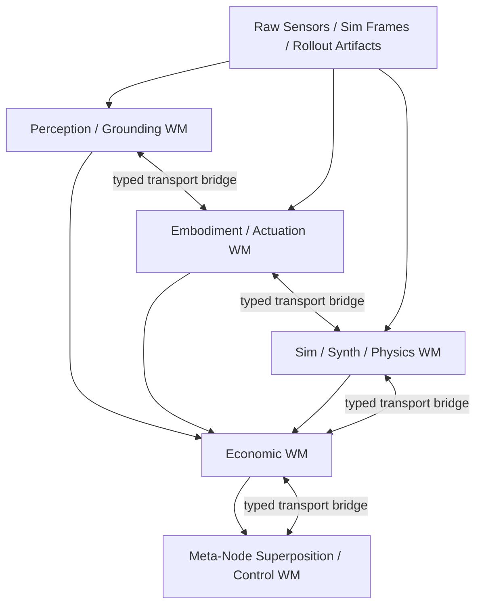

# Multi-WM Architecture Plan

## Purpose

This document defines the next architectural expansion beyond the current semantic-world-model and economic-world-model readiness work.

It is intentionally a plan document, not an implementation pass.

The central question is:

- which world models should exist as canonical state owners
- in what order they should be built
- how they should communicate without collapsing into one giant latent blob
- what should be built next now

## Executive Conclusion

Yes, the proposed topology makes architectural sense, with two important
constraints:

- each lower world model must own a canonical, typed, replayable state surface
- the economic world model should sit above those canonical state surfaces as
  the primary allocator-governor, but **not as the sole sovereign governor**
- the meta-regal-node superposition WM should sit above the economic WM to
  compose multiple domain-governance nodes (economics, anti-reward-hacking,
  plausibility, safety, deployment truth) under regime-sensitive Pareto, veto,
  and admissibility logic
- the cross-WM transport layer should be middleware between adjacent world
  models, not a premature mother-latent that dissolves boundaries

The recommended canonical stack is:

1. Perception / grounding WM
2. Embodiment / actuation WM
3. Sim / synth / physics WM
4. Economic WM over those lower WMs (first-class allocative contributor)
5. Meta-regal-node superposition / control WM above the economic WM
   (composes governance pluralism, not just economic allocation)

The recommended next WM to build is:

- **Sim / synth / physics WM**

That is the highest-leverage next step because the current production flywheel gap is less about semantic representation itself and more about what the stack actually decides to simulate, diffuse, synthesize, admit, and feed back into training.

## Cross-Phase Neuralization Rule

Every new WM or future enabling phase should launch with bounded learned seams from its first implementation tranche.

That means:

- heuristics are allowed only as explicit priors and fallback logic
- those priors must sit behind typed `disabled|auto|required` helper/runtime contracts
- helper status, promotion stage, and decision traces must be emitted as canonical receipts
- epiplexity-based inferential learnability should be carried as canonical typed metadata once a WM starts affecting replay, admission, simulation, diffusion, or training selection
- no new WM should be allowed to land as a heuristic-only island that will later require a cleanup-style “heuristic purge”

This rule applies to:

- sim / synth / physics WM
- perception / grounding WM
- embodiment / actuation WM
- economic WM consolidation
- cross-WM transport bridges
- local meta-node neuralization
- the later meta-node superposition / control WM
- future deployment-enabler phases anywhere learned routing, calibration, or policy support appears

This matters especially for the downstream WMs. Perception, embodiment, and sim/synth/physics should not only emit state; they should also emit bounded inferential learnability classes about which scenes, branches, physics regimes, or control contexts are actually improving the stack under compute and governance constraints. The economic WM should eventually consume those typed inferential receipts directly rather than reconstructing learnability from scattered sidecars later.

## No-Stub / Real-or-Unavailable Rule

Future WM work should inherit an explicit bias against literal stub defaults.

That means:

- if a surface is only there for smoke or scaffolding, it should require explicit `stub` posture rather than silently becoming the default runtime
- if a real OSS provider can be named and integrated later, the runtime posture should be `real` or `unavailable`, with `auto` allowed only when it records an honest fallback receipt
- planning-only fallback is acceptable when the real bottleneck is weights, GPU, assets, or calibration, but it must be named as planning-only and must not masquerade as materialized capability
- every later WM should inherit the same rule:
  - perception / grounding WM
  - embodiment / actuation WM
  - sim / synth / physics WM
  - economic WM successor lanes
  - transport-bridge layers
  - local meta-node neuralization and later superposition/control WM

Operational consequence:

- we should prefer real-or-unavailable provider contracts plus explicit backlogs over introducing new placeholder modules that later require another purge pass
- the remaining model bring-up work should be tracked in `scripts/FOUNDATION_MODEL_BRINGUP_BACKLOG.json`

## Per-WM Heuristic Review Rule

The earlier heuristic/advisory purge pass was an important repo-wide first sweep, but it should not be treated as globally final for multi-WM work.

For each WM boundary, we should explicitly rerun the question:

- which deterministic priors still materially shape this WM
- which of them may remain explicit fallback priors
- which of them must become learned/helper seams
- which outputs should become canonical metadata, preconditions, work orders, or bounded authority

Do not assume the earlier heuristic pass already finished that job for every future WM module just because it covered the highest-leverage live stack at the time.

For each WM tranche, this review should be done against the WM's own:

- canonical state contracts
- runtime ownership boundaries
- replay/training exports
- benchmark and promotion surfaces
- adapter and execution interfaces

The expected outcome is:

- heuristics may remain only as explicit priors/fallbacks with receipts
- no WM should be declared structurally complete while it still contains unreviewed deterministic owners that could have been lifted into learned/runtime-package seams
- the honest reason to stop should be data, GPU, asset, calibration, or benchmark limits, not the assumption that a prior global purge already covered the WM implicitly

## Complete Subsystem Rule

Each WM should be built as a complete subsystem target, not as a partial architecture exercise.

For this repo, "complete subsystem" means:

- canonical typed state contracts exist
- bounded learned seams exist anywhere the subsystem needs learned routing, calibration, scoring, or control support
- those seams have real runtime-package contracts and `disabled|auto|required` loading posture
- the live production loops already call through the subsystem boundary rather than bypassing it with parallel helper logic
- receipts, replay exports, benchmark gates, and training-manifest artifacts already exist so later training and promotion do not require bespoke joins
- the remaining blockers are stated honestly as:
  - dataset density
  - GPU budget / training time
  - grounded hardware or sim assets
  - calibration truth
  - benchmark evidence
  - external provider maturity

The target posture is:

- damn-near production-ready in subsystem structure and runtime wiring
- explicitly not pretending the subsystem is production-ready when the missing pieces are still real data, GPUs, calibration, or Unitree-class hardware/sim prerequisites

For the G1/R1-facing roadmap, each subsystem should be pushed until the main remaining bottlenecks are honest Unitree-class readiness inputs rather than missing neural scaffolds, missing runtime loops, or missing package contracts.

## Program Timing Assumption

Assume the first serious multi-WM training runs start on September 1, 2026.

Assume also that the stronger end target is September 30, 2027:

- the Unitree G1 control loop is running sustainably
- replay, telemetry, calibration, safety, and governance receipts are being collected continuously
- the stack can feed those receipts into recurring training and bounded redeployment
- ongoing improvement is happening from the live loop rather than from isolated integration events only

That changes the near-term job of this plan:

- from March 27, 2026 through August 31, 2026, the priority is to lay the plumbing across the current multi-WM architecture
- starting September 1, 2026, the priority shifts from structural bring-up to training, calibration, benchmark accumulation, and Unitree-directed subsystem hardening

For this plan, "all plumbing laid by August 31, 2026" means:

- the sim / synth / physics WM has canonical state, receipts, replay/training exports, runtime-package seams, and real-or-unavailable provider lanes for simulation, diffusion, render, predictive-state, and backend routing
- for Phase 1 backend closure specifically, "canonical state and runtime-package seams" now includes backend-specific deployment contracts plus upstream runtime-pack contracts, so Isaac/Unitree and Holosoma readiness can be represented as typed pack-ready / pack-partial / pack-blocked state rather than vague backend labels
- for that same Phase 1 backend closure, the host-reality scan must be runnable from repo root and emit a compact local usable-profile / install / preflight summary, so remaining Category B blockers are read from an explicit host report rather than inferred from scattered receipts
- and those blocked local truths must propagate through launch, work-order, and trainer-facing surfaces; otherwise Phase 1 would still be hiding pseudo-readiness downstream of the scan itself
- the perception / grounding WM has canonical scene/grounding state, evidence-routing ownership, temporal-state seams including V-JEPA 2, calibration/provider truth, and replay/training exports
- the embodiment / actuation WM has canonical body/action/observation state, latency and calibration receipts, safety-adjacent runtime contracts, and Unitree-facing adapter insertion points even if real assets and hardware are still pending
- the economic WM can consume lower-WM typed receipts directly rather than reconstructing them from sidecars
- the later WM-transport layer has reserved typed contract boundaries and adapter insertion points, even if full ontology-mediated transport training happens after lower-WM training begins

What is not required by August 31, 2026:

- full benchmark proof
- production-sized corpora
- full GPU sweeps
- final Unitree G1 assets and hardware calibration
- final WM-transport ontology realization

What should happen after September 1, 2026:

- train the lower-WM helper and predictive lanes on the now-stable canonical surfaces
- accumulate receipts, calibration evidence, and benchmark results instead of continuing architecture drift
- harden the economic WM over real lower-WM outputs
- begin ontology-mediated WM transport only after the lower-WM training surfaces and economic-WM ingestion surfaces are structurally real
- as hardware comes online, convert those trained surfaces into recurring on-robot loops instead of treating G1 as a one-time integration event

Operational cadence after September 1, 2026:

- run a weekly A100-backed program rather than an occasional catch-all training burst
- work sub-module by sub-module inside each WM instead of trying to "train the whole architecture" at once
- each weekly pass should follow one WM-scoped order:
  - loop runs and provider bring-up first
  - receipt and corpus export second
  - training runs third
  - fine-tuning only when the loop-run receipts and benchmark gates say the lane is real enough
- the expected initial emphasis is:
  - sim / synth / physics sub-modules first
  - then perception / grounding sub-modules
  - then embodiment / actuation sub-modules
  - then economic-WM consolidation over the now-trained lower-WM outputs
  - then local meta-node neuralization and later meta-node superposition / control lanes over the now-trained lower-WM and economic-WM outputs
- the later transport/bridge work and meta-node lanes should consume those trained lower-WM surfaces rather than competing with them for the same weekly A100 budget too early

The main governance implication is:

- after September 1, 2026, new architectural work should be held to a higher bar
- new structure is allowed only when it closes a proven missing contract boundary for training or Unitree-class deployment readiness
- otherwise the effort should go into data, GPUs, providers, calibration, benchmarks, and whole-loop evidence
- by the time the program reaches September 2027, the remaining blockers should be model quality, data density, compute, calibration, and safety evidence, not missing loop plumbing for autonomous operation and improvement

## Phase Exit Rule

Do not move to the next named phase just because the next phase is conceptually attractive.

The correct sequencing rule is:

- keep executing the current phase while any named explicit gap is still addressable by:
  - owned runtime wiring
  - typed contracts or receipts
  - helper/runtime-package integration
  - adapter implementation
  - canonical-state consolidation
  - replay/training/reporting integration
- only advance when the honest main blockers for the current phase are primarily:
  - data or corpus density
  - GPU budget or training time
  - unavailable external assets or providers
  - calibration truth
  - benchmark evidence
  - target-hardware or target-sim access

In other words:

- do not leave an implementable ownership/adaptation/runtime gap behind just because a later WM is more interesting
- do move on once the current phase is structurally real and the main remainder is genuinely externalized into data/GPU/asset/benchmark constraints

This rule applies to Phase 1 and every later WM or deployment-enabler phase in this document.

## Mechanics-First WM Readiness Rule

Do not count a WM as "stood up" just because it can log, summarize, or emit a typed state object.

This rule does not de-emphasize neuralization.
In this roadmap, neuralization is part of scalable mechanics.
Learned control, prediction, adaptation, routing, and state refinement should become part of the real subsystem as early as they can honestly carry load.
What should be rejected is fake neuralization that sits above missing executors, adapters, safety gates, replay exports, or downstream consumers.

A WM should count as real only when it owns a bounded closed loop with:

- real upstream ingress or honest provider-unavailable truth
- a real executor, backend, controller, or explicit execution gate
- canonical state plus receipts
- replay, training, and promotion hooks
- all relevant downstream modules for the future full-loop, hardware-integration-ready stack actually consuming that state and changing behavior because of it
- benchmark evidence that the module is doing more than describing the world after the fact

This means:

- a module that only logs desired actions is not an embodiment / actuation WM yet
- a module that emits rich scene state that nothing important consumes is not a perception / grounding WM yet
- a module that compiles synthetic agendas but does not drive execution, admission, replay, and training feedback is not a complete sim / synth / physics WM yet

Every WM phase should be treated as two subtracks:

- scalable mechanics substrate
- learned / neural layer

These are not opposing priorities.
The learned / neural layer is part of the scalable mechanics substrate once it affects the real loop through canonical state, receipts, execution, replay, and training.

The learned / neural layer should not be treated as primary completion while the scalable mechanics substrate is still missing:

- executor or backend ownership
- controller or adapter ownership
- safety or precondition gates
- replay / training exports
- downstream runtime consumption

Use this maturity ladder whenever a phase claims progress:

1. `schema_only`
2. `logging_only`
3. `shadow_runtime`
4. `bounded_runtime_authority`
5. `benchmark_gated_primary`
6. `production_recurrent`

Cross-WM dependency rule:

- a higher WM should not treat a lower WM as canonical just because the lower WM reached `schema_only`, `logging_only`, or a pretty demo
- for future full-loop and hardware-ready use, lower WM state should be considered mature only once the lower layer has crossed `bounded_runtime_authority` and its relevant downstream consumers are actually wired

## Habitat Extraction Posture

The stack has borrowed useful design patterns from Habitat-style codebases.
The Habitat pass is not exhausted.

### What has been absorbed

Perception / Grounding WM (Phase 2) has already absorbed the right level:

- provider/dataset/task/resource surface separation as typed lower-WM state
- explicit sensor/provider truth
- loop-facing compilation with downstream consumption
- deployment/headroom surfaces as first-class WM state

### What remains open

Sim / Synth / Physics WM (Phase 1.x) has the biggest remaining Habitat-derived
opportunity. This is an explicit reopenable Phase 1 adoption track.

#### Design-pattern adoption (no code dependency)

- **Simulator/task separation**: Habitat cleanly separates simulator config,
  task config, and measurement config. The sim-synth backend/runtime/execution
  substrate should borrow this contract discipline.
- **Articulated embodiment + sensor config**: Habitat's articulated-agent and
  sensor-suite config patterns are directly relevant to Isaac/Unitree adapter
  discipline and Holosoma motion execution.
- **Scene/measurement harness**: Habitat's `Measure` pattern maps to typed
  per-branch evaluation receipts and benchmark harnesses.
- **Semantic scene hierarchy**: Habitat's dataset/scene hierarchy exporters
  inform Isaac asset organization and scene decomposition.

#### Real code / provider adoption candidates (requires evaluation)

- **Camera geometry / view-warp**: Habitat's camera utilities are directly
  relevant to sim-real visual consistency and view-transform discipline.
  Evaluate for selective borrowing.
- **Vectorized runtime/eval**: Habitat's `VectorEnv` pattern is relevant to
  batch sim execution and branch parallelism. Evaluate for pattern adaptation.
- **Play / benchmark harnesses**: Habitat's interactive evaluation patterns
  inform the interactive sim-eval and benchmark-gating workflow. Evaluate for
  selective adaptation.

#### GPU/runtime-blocked items

- Real Isaac Sim + Habitat-style scene loading with Unitree URDF assets
- Real GPU-backed vectorized sim with batch rendering
- Real sensor-suite config with Isaac camera sensors
- Real benchmark harnesses with GPU-backed physics evaluation

These sit alongside existing Phase 1 external backlog items.

### Anti-overfit rule

Borrow patterns, borrow contract ideas, borrow utilities, maybe borrow
selective code. **Do not**:

- inherit Habitat's ontology
- make Habitat the master environment abstraction
- flatten WM boundaries into one runtime container
- let Habitat provider conventions override this repo's provider truth doctrine

### Cross-WM resource surfaces

The resource surface pattern (provider/dataset/task/deployment-resource)
established in Phase 2 Perception is not Perception-specific. Each lower WM
should independently carry its version of these typed surfaces:

- Sim / Synth / Physics: backend availability, GPU headroom, sim fidelity,
  materialization latency, branch capacity
- Embodiment / Actuation: action-feasibility latency, on-device vs companion
  placement, joint-limit and safety posture
- Economic: allocation budget, cross-WM resource tradeoffs (consumes lower-WM
  surfaces, does not originate them)

## Future Economic WM Architecture

The future upstream Economic WM (above the lower WMs, below the meta-regal-
node WM) should be designed as a **neuralizable, scalable, typed
allocator-governor**: the canonical world model of productive flow,
constraint, dissipation, and allocative opportunity across the stack.

It is **not**: a scalar reward head, a dashboard, a PnL tracker, a thin
weight-picker, a mother-latent, or the **sole sovereign governor** of the
stack. It is a first-class allocative contributor within a broader
superposed governance field. See
`docs/economic_world_model/doctrine_meta_regal_node_wm.md` for the
governance-pluralism posture.

### Key design properties

- **Multi-timescale**: fast variables (local routing, dispatch), meso variables
  (task allocation, budget routing), slow/near-adiabatic variables (objective
  structure, deployment-trust invariants). Slow variables must not swing
  violently with local noise.
- **Asymmetric transport**: upward transport (receipts, abstraction, bottleneck
  aggregation) is distinct from downward transport (allocative fields, shaping,
  budget envelopes, admissible Pareto slices). Not the same tensor reversed.
- **Four-component decomposition**: state estimator (switching SSMs) → dynamics
  model (counterfactual forecasting) → allocator/compiler (distributional
  Pareto) → governance/reciprocity layer (typed bidirectional coupling).
- **Staged neuralization**: typed ontology first → neural state estimation →
  neural dynamics → neural allocator → local shaping compilers. Neuralization
  follows typed design, not precedes it.
- **Quant-inspired imports**: coherent risk, distributional Pareto policies,
  regime switching, risk budgeting, stress testing, execution-cost awareness —
  as algorithmic patterns, not worldview.

Full doctrine:
`docs/economic_world_model/doctrine_economic_wm_future_architecture.md`

## Architectural Position

### What already exists

The repo already has important canonical-state substrate pieces:

- `RuntimePacket` in `src/runtime/packets.py`
- `EvidenceBus` and `BeliefState` in `src/evidence/bus.py` and `src/evidence/belief_state.py`
- `SemanticWorldModelState` in `src/world_model/semantic_world_model.py`
- semantic selection, orchestration, meta-transformer, queue, sampler, and coverage helper lanes that now emit honest runtime receipts

That means the repo is no longer starting from zero. The missing step is to extend this pattern to additional WMs rather than leaving sim/physics/vision/actuation functionality scattered across scripts, stubs, and helper surfaces.

### What should not happen

Do not:

- build a giant shared latent that replaces typed contracts
- make external OSS models native truth owners
- deeply neuralize the economic WM before lower WMs emit their own canonical state
- treat the meta-node WM as the next immediate task

### What should happen

Do:

- keep frozen OSS models as typed state providers where they are already strong
- make each WM cybernetic and neuralized around canonical state, receipts, and governance
- let the economic WM become the allocator/governor over lower WMs once those lower surfaces are real
- add the transport layer only after at least two adjacent WMs emit stable canonical surfaces

### Advisory posture inside the WM topology

The multi-WM topology only stays honest if internal WM-to-WM communication is not treated as another advisory blob layer.

The right doctrine is:

- external OSS providers can remain advisory or pluggable
- preview/report tools can remain advisory
- internal typed state, readiness classes, helper traces, and selection receipts should graduate into canonical metadata, preconditions, work orders, or bounded authority as they begin to affect runtime or training

This matters because later:

- the sim / synth / physics WM
- the perception / grounding WM
- the embodiment / actuation WM
- the economic WM
- the transport bridges between them

must communicate through typed state and receipts rather than culturally "optional" advisories.

## Two Ontology Layers

Do not collapse ontology into one vague layer.

The architecture needs two distinct ontology roles:

1. operational / module-level ontology inside the stack
2. WM-transport ontology for adjacent-WM interoperability

Neither of these should become a giant symbolic mother-WM.

### 1. Operational / module-level ontology

This is the existing in-stack ontology substrate:

- canonical typed operational state for entities, tasks, datapacks, events, provenance, governance hooks, and module/runtime state
- the cybernetic operational digital-twin layer that modules actually read from and write to
- not just static persistence or a passive registry

This layer should become more neuralized over time, but remain operationally grounded:

- learned embeddings over object, action, event, and datapack types
- uncertainty-aware assertions rather than flat boolean claims only
- richer temporal and event structure over operational trajectories
- trainable module-to-ontology and ontology-to-module adaptors where that improves fidelity

Its RL / training role should be:

- improving module-to-ontology and ontology-to-module encoding / decoding fidelity
- improving event and state prediction plus temporal consistency
- improving uncertainty calibration and provenance quality
- improving governance satisfaction and policy-compliance quality
- using completed-loop postmortems, reconstruction quality, calibration quality, and operational yield as the main training signals

Important boundary:

- this is not permission to rewrite the repo’s frozen core reward math directly right now
- reward for this layer should come from completed-loop quality, reconstruction, calibration, provenance, and operational yield, not from ontology taking over the core reward path

### 2. WM-transport ontology

This is distinct from the operational ontology.

It is the typed semantic and governance contract for cross-WM interoperability between adjacent world models.

Its job is to define:

- which WM-to-WM mappings are semantically valid
- which uncertainty, provenance, and governance fields must survive translation
- which translated outputs remain actionable for the downstream WM

This layer should work with, not replace, the differentiable bridge:

- ontology = typed semantic and governance contract
- isomorphic tensor / transport bridge = compiled differentiable realization that respects that contract

Do not replace the transport tensor with ontology text or symbolic graph rewriting.
Do not replace the ontology contract with an unconstrained tensor either.
They are complementary layers.

Its RL / training role should be:

- improving WM-to-ontology-to-WM translation quality
- preserving topology, causal structure, dependency structure, and downstream actionability across WMs
- increasing successful synchronization across full loops
- decomposing gains into bridge-only, downstream-WM-only, joint, and interaction effects
- using completed-loop and postmortem reward, counterfactual improvement, governance satisfaction, and downstream economic yield as training signals for the adaptor / bridge layer

### Current honest status

Today the repo mostly has:

- operational ontology substrate and plumbing
- event/provenance/governance hooks
- module-facing typed state scaffolding

Today the repo does **not** yet have:

- a fully neuralized operational ontology layer
- a full WM-transport ontology implementation
- a full ontology-mediated adjacent-WM transport runtime

The sequencing remains:

1. lower WMs first
2. economic WM consolidation over lower canonical state
3. ontology-mediated WM transport between adjacent WMs

That sequencing should not be inverted by introducing a premature ontology mother-layer.

### 3. Datapack Mereotopology / Experience Composition Layer

Alongside operational ontology and WM-transport ontology, the stack also needs an explicit way to represent **experience composition** as a structured object.

This layer defines:
- source slices
- transformed descendants
- part-whole relations
- temporal insertion order
- lineage across WMs
- validation and admission history
- replay/training/deployment touch history
- functional role tags such as:
  - grounding
  - semantic prior
  - robustness expansion
  - calibration evidence
  - embodiment relevance
  - deployment realism
  - counterfactual branch value
  - economic-yield relevance

Epiplexity should help shape this layer by providing architectural and functional learnings around:
- structure under bounded compute
- useful compression versus dead accumulation
- what kinds of artifact slices actually support later learning or control
- how to distinguish high-volume but low-yield data from compact but high-yield structured evidence
- how source slices differ not just by origin but by the degree to which they preserve action-relevant structure across transformations

If typed canonical surfaces prevent collapse into one uninterpretable mother latent, this new layer should prevent collapse into an uninterpretable **bag of experience**.

## Topology



Interpretation:

- perception owns canonical scene and grounding state
- embodiment owns canonical body, capability, and control state
- sim/synth/physics owns canonical synthetic branch, physics fidelity, and simulation agenda state
- economic owns pricing, allocation, queueing, value, and governance over the lower states
- meta-node superposition owns cross-WM policy over objectives, Pareto tradeoffs, and governance meta-choice

## Sequencing Rule

The right sequencing is:

1. finish enough lower-WM canonical state so the economic WM has real things to consume
2. consolidate the economic WM over those lower-WM surfaces
3. add the cross-WM transport bridges
4. only then build the meta-node superposition/control WM

So the answer to “should the economic WM be fully stood up first, or should downstream WMs be stood up first?” is:

- the economic WM should continue to be hardened now
- but it should **not** be considered fully neuralized or complete before at least the sim/synth/physics WM and one of perception or embodiment emit canonical state

## Humanoid Target Implications

The target hardware matters architecturally.

If the intended long-term target is Unitree G1/R1-class readiness, then several current repo assumptions must be treated as provisional rather than production-shaped:

- current environments are mostly fixed-base and tabletop-centric
- current embodiment assumptions are still arm/gripper-oriented
- current policy and adapter widths were not chosen under a 21+ DoF humanoid requirement
- current safety and observation assumptions are not yet real-time, proprioceptive, or whole-body enough

### Model-capacity implication

Not every model in the stack needs to become large.

The right rule is:

- lower WMs that must represent high-dimensional body state, contact, locomotion, dexterous manipulation, and spatial perception should be allowed to scale materially
- the economic WM can remain relatively compact if it consumes rich canonical lower-WM state instead of trying to internalize all embodiment/perception complexity itself
- the later meta-node WM should also stay governance-sized rather than trying to become the place where raw whole-body complexity lives

That means the stack needs an explicit future **model-capacity audit**, not just more modules.

The concrete follow-on checklist for this is now captured in:

- `docs/economic_world_model/humanoid_target_readiness.md`

Subsystems that likely need capacity reconsideration for G1/R1-class readiness:

- embodiment / actuation WM encoders and action-state models
- low-level and mid-level policy heads that currently assume small action spaces
- sim / synth / physics WM components that must model contact-rich whole-body behavior
- perception / grounding WM components that must fuse egocentric vision, depth, proprioception, and spatial state
- transport bridges that must preserve richer topology across body, scene, and physics state

Subsystems that do **not** necessarily need to become large if the architecture is correct:

- economic WM policy/value layers
- governance and meta-choice helper layers
- some orchestration/control-plane helpers that operate over typed summaries rather than raw robot state

### Environment implication

The current environment portfolio should not be treated as sufficient for humanoid readiness.

Current envs such as:

- `workcell`
- `dishwashing`
- `drawer_vase`

are still useful, but they are best understood as:

- manipulation skill islands
- control-plane and replay substrate testbeds
- partial pretraining domains

They are **not** yet valid proxies for a G1/R1-class deployment regime.

For humanoid-target readiness, the environment set eventually needs to cover:

- whole-body reaching and balance while manipulating
- locomotion-plus-manipulation transitions
- bimanual coordination
- dexterous hand contact
- human-proximate safety constraints
- mobile navigation and scene traversal
- recovery from pushes, slips, and contact disturbances
- spatially extended tasks rather than fixed workcell-only episodes

This should also include an explicit future simulation lane for:

- Unitree G1/R1-class robot simulation integration

That means the repo should eventually carry a named sim-env integration path for Unitree-class embodiments rather than assuming current workcell/tabletop envs can be stretched into that role.

### Contract implication

Preparing for G1/R1-class hardware also changes what the canonical contracts must carry:

- richer proprioception
- IMU and force/torque integration
- whole-body kinematic state
- contact state and support polygon / balance context
- latency and control-frequency metadata
- hardware safety envelope refs
- mobile spatial state

This means the later embodiment, sensor-fusion, safety, and SLAM phases are not optional polish. They are part of what “hardware-readiness” means.

### Compute and deployment implication

For G1/R1-class readiness, the stack also needs an explicit compute-placement plan.

A realistic deployment split is:

- fast reflex and servo control on robot or in the robot-adjacent low-level controller
- heavier perception, 3D grounding, and some WM inference on a companion GPU or high-end onboard compute
- economic/governance layers operating at slower rates on the same companion stack or a nearby controller

That means the architecture must eventually make explicit:

- what runs onboard versus offboard
- latency and bandwidth budgets between those layers
- what happens when the companion perception stack lags or drops
- how ROS2 / DDS / Unitree SDK2 or equivalent middleware is bridged into canonical WM state
- how battery, thermal, and compute-pressure receipts feed back into planning and economics

### Compute and battery resource doctrine

For humanoid-target readiness, inferential compute capacity / availability and concrete battery availability should become first-class lower-WM resource state before they become economic-WM or meta-node allocation variables.

Sequencing rule:

- Phase 3 should own canonical `ComputeEnvelopeState` / `BatteryState`-style state plus associated thermal, reserve, placement, and QoS receipts
- Phase 3.5 should audit whether those schemas and model-capacity assumptions are actually plausible for G1/R1-class onboard and companion compute
- Phase 4A and Phase 4E should make the timing, placement, communication, and degraded-mode consequences real in the runtime loop
- Phase 5 should turn those lower-WM contracts into allocatable economic budget objects for inference, routing, simulation, diffusion, data collection, training, and conservation
- Phase 6 and later phases should preserve and govern those resource receipts, not invent raw compute or battery state at the top of the stack

Behavior should be staged across three levels:

- lower-WM state:
  - availability
  - reserve
  - thermal / health posture
  - allocatable headroom
  - placement class
  - timing / QoS assumptions
- bounded helper behavior:
  - backend selection
  - fidelity selection
  - diffusion ordering
  - synthetic-branch admission
  - runtime launch planning
  - inferential work-order formation
- later economic / meta behavior:
  - cross-resource allocation
  - conservation versus spend
  - tradeoffs between battery spend, compute spend, expected yield, safety, and governance satisfaction

The RL structure should also be staged rather than monolithic:

- lower-WM learning should predict and calibrate compute headroom, battery depletion, latency impact, thermal posture, and action feasibility under resource pressure
- bounded helper seams should learn local allocation under those constraints:
  - which branches to simulate
  - which backend or fidelity to choose
  - when to defer expensive inference
  - when to conserve battery or stay companion-heavy
- the economic WM should later learn cross-resource tradeoffs over those lower-WM contracts
- only after those layers are stable should the later meta-node/superposition layers learn higher-order Pareto policy over those resource receipts

### Asset and calibration implication

Humanoid-target readiness also requires a named robot-asset and calibration discipline.

The stack will eventually need canonical handling for:

- URDF / Xacro / SRDF and related robot-description assets
- joint naming and action-index contracts
- sensor extrinsics and intrinsics
- hand / end-effector definitions
- self-collision models
- controller gain and hardware-calibration sidecars

Without that, the lower WMs can become structurally correct while still failing on actual robot identity and calibration truth.

### Benchmark implication

The benchmark story also changes once the target is G1/R1-class hardware.

Current manipulation/workcell benchmarks remain useful, but humanoid-target promotion will need additional benchmark classes such as:

- standing and balance stability
- locomotion plus manipulation success
- push / slip / stumble recovery
- self-collision and joint-limit compliance
- foot contact and support-phase consistency
- dexterous hand task completion
- human-proximate safety behavior
- sensor-dropout and degraded-perception robustness
- latency / watchdog / companion-link degradation behavior

This means the repo eventually needs a humanoid-target benchmark gate, not just stronger versions of the current workcell gates.

## Recommended WM Set

### 1. Perception / Grounding WM

Purpose:

- convert raw camera/depth/segmentation/tracking outputs into canonical world state
- own object, geometry, grounding, uncertainty, and scene persistence

Why needed:

- the repo currently has strong ingredients, but still has split ownership across SceneTracks, semantic fusion, map-first, rollout labeling, and vision stubs
- real production needs canonical state, not “vision sidecars plus semantic consumers”

Current anchors:

- `src/vision/scene_ir_tracker/io/scene_tracks_runner.py`
- `src/vision/reconstruction/four_d_reconstruction.py`
- `src/orchestrator/semantic_fusion.py`
- `src/world_model/semantic_world_model.py`
- `src/vla/rollout_labeler.py`

Current gaps:

- `src/vision/backbone_stub.py` is still a literal placeholder
- `src/vla/semantic_vla.py` is still a placeholder analyzer
- SceneTracks real grounding is host-blocked by SAM3D/GPU
- representation ownership is split instead of WM-owned

Disposition:

- this should become an upgraded WM that supersedes and encapsulates the current vision/grounding path rather than living beside it forever

### 2. Embodiment / Actuation WM

Purpose:

- own canonical body state, action semantics, capability envelopes, latency, and physical feasibility
- bridge from task/governance intent to embodiment-feasible action plans

Why needed:

- the repo has embodiment scaffolding, but not a canonical actuation WM
- current action/control assumptions are still mostly fixed-base manipulation assumptions
- future Unitree R1/G1-style control requires body-aware state, not just policy outputs

Current anchors:

- `src/embodiment/core.py`
- `src/embodiment/registry.py`
- `src/runtime/observation_adapter_v2.py`
- `src/runtime/action_adapter_v2.py`
- `src/motor_backend/*`

Current gaps:

- no whole-body embodiment state
- no URDF-driven body contract
- no humanoid locomotion or dexterous hand interface
- no real-time reflex/control separation yet

### 3. Sim / Synth / Physics WM

Purpose:

- own the canonical state for:
  - what should be simulated
  - what should be diffused/generated
  - what synthetic branches should be created
  - which physics backend/fidelity/randomization regime should be used
  - what receipts determine whether branches are valuable, admissible, and training-worthy

Why needed:

- this is currently the thickest flywheel gap
- current logic is improved but still distributed across orchestrator, diffusion, synthetic branch collection, backend shims, and physics stubs

Current anchors:

- `src/orchestrator/semantic_simulation.py`
- `src/orchestrator/diffusion_requests.py`
- `src/evidence/gen2sim_validity.py`
- `scripts/collect_local_synthetic_branches.py`
- `src/envs/physics/*`
- `src/motor_backend/holosoma_backend.py`

Current gaps:

- `src/envs/physics/isaac_backend.py` is now an explicit shadow-contract backend rather than a literal stub, but concrete Isaac Sim / Isaac Gym / Unitree asset execution is still an open Phase-1 gap
- parts of the LSD / NAG / GGDS path remain stubby
- agenda ownership is still orchestrator-heavy instead of WM-owned
- diffusion, gen2sim, and synthetic branch generation are not yet owned by one canonical state service

### 4. Economic WM

Purpose:

- value, allocate, schedule, gate, and learn over lower-WM states and receipts

Why it remains central:

- this is the repo’s core identity
- semantic WM is already functioning as one subset feeding toward this layer
- the recent work has made many control-plane helpers real and bounded

What still changes later:

- the economic WM should consume lower canonical WMs more directly instead of leaning on summary proxies
- its future neuralization should condition on lower-WM receipts, not just heuristic planning fields

### 5. Meta-Regal-Node Superposition / Control WM

Purpose:

- compose multiple neuralized governance nodes under regime-sensitive Pareto,
  veto, and admissibility logic
- emit the final cross-WM shaping and control fields
- prevent any single domain ontology (including economics) from silently
  becoming the total governance surface

#### Why the Economic WM cannot be sovereign

The stack’s telos is not "optimize economics." It is governed robot control
under multiple non-collapsible realities: physical plausibility, safety,
anti-reward-hacking, deployment truth, embodiment limits, coordination
integrity. The Economic WM is a first-class allocative contributor, but not
the final court. If it becomes too central, the stack risks translating
everything into economic language and treating physical/safety/deployment
reality as subordinate constraints.

#### Three governance levels

1. **Subsystem / local WM level**: perception, embodiment, sim/synth,
   economic, etc. Each owns local truths and local shaping.
2. **Domain governance level**: economic allocation, anti-reward-hacking,
   plausibility/geometry truth, deployment truth, safety, data value,
   later coordination. Each becomes a neuralized evaluative-governance process.
3. **Superposition / meta-governance level**: the WM that models and composes
   the governance nodes themselves. This is the meta-regal-node WM.

#### Two kinds of Pareto optimization

- **Intra-domain** (inside the Economic WM): throughput vs energy vs wear vs
  compute vs error. Multi-objective within one evaluative domain.
- **Inter-domain** (inside the meta-regal-node WM): economics vs
  anti-reward-hacking vs plausibility vs deployment truth vs safety. More
  fundamental: governs whether intra-domain optimization can be trusted.

These must be kept architecturally distinct.

#### What the meta-regal-node WM must model

Meta-governance state: current regime, conflict structure among nodes, node
confidence/trust, active hard constraints, admissible Pareto region,
persistence/hysteresis in governance mode.

Meta-governance composition: when nodes are in Pareto relation, lexicographic,
veto-like, advisory, or confidence-weighted.

Meta-governance transport — downward: composed shaping fields, filtered budget
envelopes, provenance. Upward: conflict receipts, override receipts,
governance failure receipts, reward-hack suspicion receipts.

#### Why "superposition" is the right word

Governance nodes should not necessarily collapse immediately into one scalar
or one strict hierarchy. Sometimes anti-reward-hacking is dominant, sometimes
plausibility, sometimes deployment truth, sometimes economics matters most
within a safe feasible region, sometimes coordination integrity is the
relevant macro pressure. The nodes coexist in a partially unresolved relation
until regime, embodiment state, task family, deployment mode, and confidence
conditions tell the meta-layer how to compose them.

This is structurally different from "economics outputs reward, regal nodes
clip it." It is: structured superposition, regime-sensitive composition,
partial vetoes, admissible regions, soft and hard constraint interplay, and
typed provenance.

#### Governance pluralism principle

The architecture preserves pluralism at the governance layer while allowing
strong specialization below it. Each governance node specializes in its
domain. The meta-layer composes without collapsing. No single domain ontology
(including economics) can silently redefine the others.

Important clarification:

- there are already local meta-node objects inside the semantic WM and
  adjacent helper lanes
- this future WM does not replace those local objects
- instead, it becomes the higher-order control layer that conditions,
  calibrates, and learns over them

Implication:

- the stack should not jump from today’s bounded local meta-node surfaces
  directly to an overarching superposition WM
- there needs to be a local meta-node neuralization and robustness tranche
  first, and domain governance nodes must be individually neuralized
- the meta-layer only makes sense once its inputs are mature enough to compose

Current status:

- not ready to build next
- should remain a later phase after lower WMs, Economic WM, and transport
  layers are real

Full doctrine:
`docs/economic_world_model/doctrine_meta_regal_node_wm.md`

## Why Sim / Synth / Physics WM Is Next

The current repo is already much farther along on semantic control-plane honesty than it is on self-improvement loop ownership.

The most valuable unresolved question is no longer “can the stack describe semantics?” It is:

- what exact simulation jobs get launched
- what diffusion jobs get requested
- what synthetic branches get created
- how those branches are physics-conditioned
- how outcome receipts come back into replay, training, and economic valuation

This is why the next WM should be sim/synth/physics before a standalone vision WM build-out.

That does **not** mean vision is unimportant. It means:

- the immediate flywheel bottleneck is agenda compilation and synthetic branch governance
- the later perception WM should plug into the sim/synth/physics WM as a provider of grounded state and uncertainty

## Phase Plan

### Phase 0 - Current Baseline and Preconditions

Status:

- largely in progress / partially landed

Objective:

- preserve the current economic-WM readiness work as the substrate for the multi-WM buildout

Already present:

- runtime packet substrate
- evidence bus and belief state
- semantic world-model packet
- event spine / governance / counterfactual / value-target sidecars
- honest helper promotion paths around selection, orchestration, queueing, sampler, fill routing, gen2sim admission, and semantic runtime scorers

Phase gate to start Phase 1:

- keep the current semantic/economic control-plane receipts as the source of truth
- do not reopen frozen Phase B math

### Phase 1 - Sim / Synth / Physics WM

This is the phase to focus on next. It is the only phase described here at near-implementation detail.

### Phase 1 objective

Create a canonical sim/synth/physics WM that consolidates simulation agenda compilation, diffusion conditioning, gen2sim admission context, backend/fidelity selection, and synthetic branch receipts into one governed state surface.

Complete-subsystem interpretation for Phase 1:

- the subsystem should own live simulation planning, diffusion planning, backend/fidelity routing, branch planning, and receipt emission in the real runtime loop
- it should already contain the runtime-package lanes for the learned seams it needs
- do not advance to Phase 2 while Phase 1 still has implementable ownership, adapter, receipt, or training-feedback gaps inside the sim/synth/physics boundary
- after that, the remaining blockers should be honest ones such as:
  - lack of real Unitree-class sim adapters
  - lack of grounded whole-body datasets
  - lack of GPU-backed large-scale predictive training
  - lack of calibration and benchmark receipt density

### Phase 1 ownership boundary

This WM should own:

- simulation agenda state
- branch-generation state
- diffusion-conditioning state
- backend and physics fidelity state
- synthetic admission and outcome receipts
- branch-to-training feedback state

This WM should not own:

- raw perception model execution
- whole-body actuation control
- pricing or economic settlement itself
- final meta-node governance policy

### Phase 1 current repo surfaces to absorb

| Current surface | Current problem | Future role under sim/synth/physics WM |
| --- | --- | --- |
| `src/orchestrator/semantic_simulation.py` | mixes selection, agenda, execution setup, and artifact emission | becomes a client of the WM runtime/compiler |
| `src/orchestrator/diffusion_requests.py` | diffusion request logic is adjacent to but not owned by a WM | becomes a diffusion-plan adapter fed by WM state |
| `src/evidence/gen2sim_validity.py` | admission logic exists but is not the sole owner of synth state | becomes one submodule inside WM admission/receipt logic |
| `scripts/collect_local_synthetic_branches.py` | branch generation is script-owned | becomes a WM branch-generation adapter / worker |
| `src/envs/physics/isaac_backend.py` | explicit shadow-contract backend; concrete Isaac/Unitree asset runtime still missing | becomes one backend adapter behind WM backend routing |
| `src/motor_backend/holosoma_backend.py` | backend-specific bridge is outside WM ownership; only shadow work-order materialization is wired today | becomes an execution adapter used by the WM |
| `src/envs/lsd3d_env/ggds.py` and NAG/LSD surfaces | typed provider contracts and work-order/scene materialization now exist, but concrete renderer/LDM execution is still missing | becomes an explicit branch renderer/generator provider, not an owner |

### Phase 1 proposed module structure

Recommended additive package:

```text
src/world_model/sim_synth_physics/
  __init__.py
  state.py
  agenda.py
  compiler.py
  backend_adapters.py
  backend_router.py
  physics_contracts.py
  randomization.py
  render_providers.py
  diffusion_contracts.py
  synthetic_branches.py
  gen2sim_admission.py
  receipts.py
  calibration.py
  runtime.py
  dataset.py
  training.py
  promotion.py
  adapters/
    semantic_inputs.py
    economic_inputs.py
    embodiment_inputs.py
    backend_pybullet.py
    backend_holosoma.py
    backend_isaac.py
```

Recommended scripts:

```text
scripts/compile_sim_synth_physics_plan.py
scripts/run_sim_synth_physics_loop.py
scripts/train_sim_synth_physics_planner.py
scripts/eval_sim_synth_physics_planner.py
```

### Phase 1 canonical state objects

Recommended typed objects:

- `SimSynthPhysicsWorldState`
  - top-level canonical state for one run/episode/planning window
- `SimulationAgenda`
  - ranked set of simulation jobs to execute
- `SimulationJobSpec`
  - one job with env family, backend, seed, objective preset, coverage targets, and expected receipts
- `PhysicsContextState`
  - fidelity, backend, timestep, randomization, calibration, and safety-relevant physics settings
- `PhysicsAdaptationPolicyState`
  - typed domain-randomization, system-identification, robot-asset, and calibration-target policy
- `BackendExecutionBindingState`
  - concrete execution binding for the chosen backend, including runtime stack, entrypoints, and asset readiness
- `DiffusionConditioningState`
  - governed diffusion request structure, not just a prompt string
- `SyntheticBranchPlan`
  - branch family, gap targets, rendering/generation mode, admission preconditions
- `BranchRenderProviderState`
  - typed NAG/LSD/GGDS provider contract per branch, including fallback honesty and materialization configuration
- `Gen2SimAdmissionState`
  - explicit branch admissibility context and helper traces
- `SimulationOutcomeReceipt`
  - outcome refs, replay refs, event/debt/governance/value refs, and readiness summary
- `PhysicsAdaptationReceipt`
  - emitted receipt for adaptation-policy readiness and target-hardware posture
- `BackendExecutionBindingReceipt`
  - emitted receipt for executor entrypoint, runtime stack, and robot-asset readiness
- `PhysicsCalibrationReceipt`
  - domain-randomization/system-ID summary and backend-quality flags

### Phase 1 input contracts

The WM should consume:

- `BeliefState`
- `SemanticWorldModelState`
- `RuntimePacket`
- coverage-loop outputs
- benchmark-gating signals
- gen2sim validity/admission receipts
- embodiment constraints when available
- economic urgency and value-target summaries

The WM should emit:

- simulation agenda
- diffusion conditioning plan
- synthetic branch plan
- composition-aware receipts for synthetic artifacts
- source-slice receipts for synthetic branches
- lineage from seed artifacts to transformed branches
- branch role tags (robustness expansion, counterfactual exploration, physics stress test, rare-event coverage, policy-refinement candidate)
- branch-level epiplexity-style estimates of structured informational yield
- branch-level estimates of whether the synthetic artifact contributes usable structure or merely volume
- functional contribution estimates (robustness yield, coverage gain, policy-improvement likelihood, deployment realism confidence, embodiment transfer plausibility)
- backend/fidelity choice receipt
- physics adaptation receipt
- backend execution binding receipt
- backend runtime bridge receipt
- backend runtime work-order receipts
- branch render-provider receipts
- branch outcome receipts
- replay-ready artifact refs
- training-feedback refs

### Phase 1 runtime flow

Recommended flow:

1. ingest semantic, economic, and embodiment context through typed adapters
2. compile a `SimSynthPhysicsWorldState`
3. rank simulation jobs and branch jobs inside one agenda
4. choose backend, fidelity, and domain-randomization regime
5. compile typed physics adaptation policy and calibration targets
6. resolve a concrete backend execution binding with runtime stack, entrypoints, and asset-readiness truth
7. compile a typed backend runtime bridge contract that names transport profile, planner-vs-servo rates, IO/telemetry contracts, safety channels, and runtime-target readiness
8. emit a `DiffusionConditioningState` for any render/generation branch
9. resolve WM-owned branch/render providers for NAG/LSD/GGDS materialization
10. compile explicit backend runtime work orders for any missing runtime targets, assets, or GPU bring-up steps
11. execute backend adapters
12. when execution is delegated to an upstream runtime, harvest upstream outcome artifacts through a WM-owned output contract rather than stopping at launch completion
13. emit `SimulationOutcomeReceipt` and related sidecars
14. feed receipts into replay, benchmark gating, and training datasets

### Phase 1 neuralization plan

Do not start with a giant generative simulator model.

Do start with bounded learned helper seams in Phase 1A / 1B itself rather than adding them later as a cleanup:

- agenda ranking
- backend/fidelity selection
- synthetic branch planning
- synthetic branch admission
- branch-value / branch-yield prediction
- physics-calibration confidence prediction

For this phase, heuristics are only acceptable as explicit priors with fallback semantics and receipt traces. 

Epiplexity should be used here both architecturally and functionally:
- architecturally, to inform how synthetic branch structure is represented and ranked
- functionally, to help estimate whether a branch is actually likely to improve future control, replay value, or data utility

Only after the receipt density is real should the WM expand into:

- learned transition models
- learned synthetic branch proposal models
- v-JEPA-2-style predictive state modules for video-conditioned future estimation and branch-future priors, preferably brought up from the upstream `facebookresearch/vjepa2` git/runtime when that is the fastest honest path

### Where v-JEPA 2 fits

v-JEPA-2-style predictive modeling should be treated as a component inside two lower WMs, not as a separate top-level WM.

Recommended placement:

- in the sim / synth / physics WM as a predictive latent module that conditions on governed video state, scene tracks, embodiment context, and action plans
- in the perception / grounding WM as a temporal grounding and scene-persistence module for continuity, occlusion recovery, event structure, and action-conditioned visual state
- pulled from the upstream `facebookresearch/vjepa2` git/runtime where that accelerates honest bring-up more than reimplementing it locally
- downstream of canonical state and typed receipts rather than replacing them
- upstream of branch proposal ranking, future-estimation receipts, and temporal grounding quality checks
- wrapped as an external/provider contract with provider truth, calibration, and benchmark gating rather than treated as native truth

### Phase 1 training targets

The first honest training targets for this WM should come from:

- branch evaluations
- value-target packs
- counterfactual evals
- governance traces
- replay outcome receipts
- coverage improvement deltas
- branch yield into later trainer datasets

### Phase 1 acceptance criteria

Phase 1 should count as landed only when:

- simulation agenda ownership is WM-owned rather than spread across orchestrator helpers
- diffusion conditioning is derived from WM state instead of flat prompt assembly alone
- synthetic branch plans are typed objects, not script-local metadata
- backend/fidelity selection is emitted as a first-class receipt
- domain-randomization / system-identification policy is emitted as a typed state and receipt, not left implicit in backend metadata, and those receipts react to backend/materialization evidence once the WM loop has run
- concrete backend execution binding is emitted as typed state and receipt, including honest Isaac/Unitree asset-readiness truth, and robot-asset/calibration/IO contracts are emitted as canonical state/receipts plus backend-local sidecars rather than left as loose missing-asset notes
- a typed backend runtime bridge contract is emitted as canonical state and receipt, so the WM can name planner-vs-servo rates, transport profile, telemetry/action/observation contracts, and safety channels instead of flattening slow-loop-to-runtime integration into generic binding metadata
- backend runtime work-order receipts are emitted for the Isaac/Unitree and Holosoma lanes, so missing runtime targets, missing assets, and concrete non-training GPU bring-up tasks are explicit loop artifacts instead of only implied by bridge or runtime-request metadata
- requested backend runtime intent is emitted as a typed runtime-request or concrete-runtime receipt, so Isaac/Holosoma paths can advance from request-binding to real evaluation or train-from-motion execution without reopening the WM boundary later
- Unitree-target humanoid asset manifests are normalized into canonical required-asset contracts rather than treated as arbitrary manifest keys, so backend readiness reflects real robot-description, calibration, safety, and control-IO prerequisites
- Isaac/Unitree/Holosoma runtime target manifests are emitted explicitly, so the WM can name which external runtime roots, SDKs, and asset trees are still missing on a host instead of flattening that state into one generic “backend unavailable” bit
- Isaac/Unitree/Holosoma runtime layout contracts and policy-bank contracts are emitted explicitly, so the WM can distinguish “repo root exists”, “upstream runtime layout is actually present”, and “usable policy surface exists” instead of treating those as one missing-target class
- backend runtime bundles and launch specs are emitted as WM-owned artifacts, so work orders can point at concrete upstream-shaped launch paths rather than only generic backlog commands
- Isaac/Unitree backend runtime artifacts include a typed executable-adapter request carrying deployment mode, robot variant, asset/calibration posture, and output expectations, so the external-runtime lane is concrete before a full in-process adapter exists
- Isaac/Unitree backend runtime artifacts also include a typed executable-adapter consumer over that request, so the WM can say which consumer path is actually taking responsibility for the request instead of collapsing request and execution mediation together
- Isaac/Unitree backend runtime artifacts also include typed adapter-execution mediation and an adapter receipt over that request/consumer pair, so the WM can distinguish request, consumer, executable mediation, launch, and harvested outcome as separate maturity rungs instead of collapsing them into generic launch status
- Isaac/Unitree backend runtime artifacts also include a typed adapter-realization surface over the execution mediation, so the WM can say whether the lane is concretely realized through a local backend-factory handoff or only through an external launch delegate before any final hardware/runtime success claim is made
- backend runtime artifacts also include a typed local backend-factory invocation/result surface over that realization, so explicit local adapter materialization is no longer hidden inside a direct backend-factory jump
- Holosoma backend runtime artifacts now carry the same request -> consumer -> adapter-execution -> adapter-realization ladder as Isaac/Unitree, so Phase 1 does not leave one backend on typed runtime truth while the other stays special-cased
- backend runtime artifacts also include a typed runtime-binding surface between upstream runtime packs and executable-adapter requests, so selected policy / motion / retargeting / launch surfaces and mode-relevant missing components are canonical loop truth instead of being re-inferred from pack-level gaps or launch metadata
- runtime bindings must also carry selected-surface evidence and host-preflight truth, so Phase 1 can distinguish:
  - contract-ready but only declared/unverified asset or motion refs
  - locally verified launch/policy/target surfaces
  - genuinely external remaining blockers
- shadow execution must consume those selected runtime-binding surfaces when building backend shadow env/work-order artifacts, so the Tier 3 shadow lane does not bypass the deeper Phase 1 runtime ladder while only echoing it in receipt metadata
- runtime layouts and upstream packs must also carry profile-level install/preflight evidence, and runtime bindings must resolve that evidence against the actually selected profile rather than blindly inheriting the pack’s preferred-profile gaps; otherwise local motion-train or local bridge lanes will look blocked by the wrong repo/install surface
- runtime targets themselves must also carry selected-target install-shape truth, not only raw path existence, and bindings/work orders/training exports must preserve which selected targets are verified versus only partial; otherwise empty SDK/asset/motion roots will still masquerade as launch-ready once a lane is selected
- runtime target/layout/policy scans should also be able to consume actual local clone/install roots and checkpoint banks without requiring every host to pre-wire env vars first; targeted autodiscovery of known upstream repo roots is acceptable as long as missing roots remain explicit and do not silently mark a lane ready
- policy-root selection must also prefer actual checkpoint-bearing roots over explicit-but-empty policy roots, and deployment/runtime-pack selection must prefer usable profiles over install-blocked roots; otherwise Phase 1 will keep reintroducing profile-selection pseudo-readiness even after target preflight is honest
- the runtime-layout contract itself should expose `usable_profiles` (not only raw `ready_profiles`), and downstream bundle/bridge/work-order/training surfaces should preserve that field; otherwise later consumers will quietly reconstruct or over-assume profile readiness from weaker root-exists semantics
- checkpoint / deploy-config / runtime-report selection inside runtime packs and bindings must also prefer the best verified local artifact over earlier missing candidates, and the chosen-ref source plus candidate-evidence summaries must survive into work-order/training surfaces; otherwise Phase 1 will keep hiding candidate-ordering ambiguity behind apparently concrete primary refs
- harvested runtime outputs must also be validated against the selected policy / deploy-config / runtime-report refs, and that validation status must survive into work-order/training surfaces; otherwise “runtime outputs harvested” will still blur together matched execution and wrong-artifact harvests
- that selected-output validation must also change downstream completion posture and trainer-source preference; otherwise the branch will preserve mismatch truth in metadata while still operationally treating the outcome as satisfactory
- inferential yield scoring and humanoid-target randomization/calibration should also be explicitly re-audited rather than left as “probably fine”; once direct verification covers them, they should leave the Category C bucket so the remaining closure conversation can focus on real external-runtime/GPU blockers
- the backend runtime receipt can distinguish `runtime_launch_prepared` from truly missing runtime prerequisites, so “host is ready but local adapter is absent” remains an honest intermediate state instead of collapsing back into generic module-missing logic
- backend runtime output contracts and outcome receipts are emitted explicitly, so upstream runtime launches can be judged by harvested outputs rather than only `launch_completed` / `launch_failed`
- backend runtime outcome receipts can also distinguish `external_launch` from `local_runtime_execution`, so concrete local Isaac/Unitree and Holosoma execution does not get flattened back into launch-shaped truth and trainer/replay consumers can preserve policy / dataset / metrics surface readiness honestly
- upstream runtime packs and policy/layout contracts carry concrete evidence, not only root/candidate names: selected primary checkpoint / deploy / runtime-report refs, profile candidate counts, repo-git metadata when available, and Isaac declared-vs-verified asset truth are all canonical WM surfaces before Phase 1 can claim the remaining blocker is “just external runtime/assets”
- once public local Unitree roots are present, Phase 1 should also squeeze the remaining non-GPU asset normalization out of them before calling the remainder external; on the current branch that now covers robot description, whole-body joint-map, and joint-limit truth, leaving whole-body latency and watchdog profiles as the explicit remaining non-GPU asset blockers
- NAG / LSD / GGDS branch/render routing is emitted as WM-owned provider contracts, receipts, and materialization artifacts, not left as free-standing provider code paths
- branch-planner fallback truth must remain explicit in canonical plan metadata and trainer exports, so a learned payload can remain visible as a trace without masquerading as active authority when the heuristic path retains control
- replay/training consume WM receipts without bespoke joins
- Isaac remains an explicit fallback until a real adapter exists, but it is no longer hidden behind a generic backend name
- the target posture is real Isaac Sim / Isaac Gym / Unitree-class backend functionality behind typed backend routing, not a permanent pybullet-only fallback loop
- the learned seams needed by the subsystem already have runtime-package loading and live-loop integration rather than existing only as loose code hooks
- the remaining gap list is primarily real-data / GPU / adapter / benchmark work, not missing subsystem wiring

### Phase 1 explicit gaps

Named gaps that should remain explicit in this phase:

- real Isaac Sim / Isaac Gym backend implementation with typed adapter ownership
- Unitree-class humanoid sim-env integration behind a typed backend contract
- concrete runtime launch/bundle execution behind the new WM-owned layout and launch-spec contracts
- concrete Isaac/Unitree executable-adapter realization behind the new request/consumer/adapter-execution receipt chain
- concrete local Isaac/Unitree adapter implementation behind the new realization surface rather than only a backend-factory/delegate contract
- concrete Holosoma local adapter implementation and real host/runtime assets behind the new request/consumer/execution/realization chain
- concrete Holosoma runtime execution and datapack/asset binding beyond the new request/consumer/execution/realization ladder
- concrete Isaac/Unitree robot assets, calibration sidecars, and simulator bindings behind the new adapter contracts
- concrete Unitree whole-body latency and watchdog contracts behind the now-derived robot-description / joint-map / joint-limit surfaces
- concrete GGDS/LDM execution at scale under the new WM-owned render-provider contracts
- concrete NAG/LSD counterfactual execution at scale beyond the new conditional execution seam
- real GPU-backed grounded video state for perception-conditioned sim
- real video-diffusion and GGDS/LDM model bring-up behind the new runtime/provider contracts tracked in `scripts/FOUNDATION_MODEL_BRINGUP_BACKLOG.json`
- concrete non-training GPU/materialization bring-up runs tracked in `scripts/NON_TRAINING_GPU_RUN_BACKLOG.json`

### Phase 1 OSS dependency posture

Use OSS as providers, not truth owners:

- MuJoCo / dm_control / PyBullet / Isaac for physics execution
- Holosoma where already integrated
- later v-JEPA-2-style predictive modules for future estimation

Target posture for this phase:

- real Isaac Sim / Isaac Gym / Unitree-class functionality should eventually sit behind the WM's typed backend adapters
- the current runtime-layout and launch-spec posture is intentionally shaped around real OSS loops such as `IsaacLab`, `unitree_sim_isaaclab`, `unitree_rl_gym`, `HumanoidVerse`, and Holosoma rather than inventing repo-local runtime conventions from scratch
- explicit fallback to PyBullet is acceptable only while the repo is still missing those adapters or the target assets
- the fallback posture should stay honest in receipts and benchmark reporting until the adapter gap is truly closed
- literal stubs should be opt-in smoke aids only; the normal posture should be real-or-unavailable with honest planning-only fallback where GPU/weights are the real blocker

The WM should own:

- canonical state
- routing
- receipts
- promotion logic
- governance hooks

### Phase 2 - Perception / Grounding WM

Objective:

- turn the current vision, scene-tracks, map-first, teacher-runtime, and grounding path into one canonical perception/grounding WM
- explicitly bring up SAM 3 / 3.1 as an external/provider lane for open-vocabulary concept segmentation and video tracking

Current branch status:

- schema/doctrine reconciliation is landed
- `compile_perception_grounding_world_state(...)` now exists and compiles canonical Perception / Grounding state from real local inputs already present in the repo
- first shadow consumers are landed:
  - Sim / Synth semantic-context consumption
  - rollout-labeling / annotation consumption
- the next Phase 2 cut is not more schema work; it is provider/runtime truth, receipt emission, and additional downstream consumption

#### Open-Vocabulary Concept Segmentation and Video Tracking

The future Perception / Grounding WM should own canonical state for:
- concept-conditioned object masks
- prompt-conditioned instance sets (text/exemplar/box/point/mask)
- object identity persistence over video and concept-track memory
- uncertainty / confidence for concept-conditioned object grounding
- object-presence / object-absence evidence and prompt satisfaction confidence
- fused object-node state once SAM outputs are merged with geometry and scene-tracks

**SAM 3 / 3.1** is the initial named provider for this lane. Its object-multiplex story is uniquely relevant for high-object-count, longer-horizon video memory (cluttered real scenes, synthetic branch evaluation, and humanoid-facing egocentric perception). However, it belongs *under* the Perception / Grounding WM rather than as a free-floating utility.

#### Provider Ownership Boundaries

- SAM 3 / 3.1 remains an **external provider**.
- The Perception / Grounding WM owns the **canonical downstream object state**.
- Raw SAM outputs are not the final semantic truth surface. The WM fuses those outputs with SceneTracks, object refs, semantic catalogs, geometry/depth, temporal continuity, and later embodiment-facing relevance.
- This prevents collapse into a new unowned "mask blob" layer. Concept segmentation enters via typed provider contracts and becomes canonical Perception-WM state.

#### Provider / Dataset / Measurement / Resource Surfaces

Borrow the useful separation pattern from Habitat-style stacks, but keep
ownership WM-native:

- `DatasetSurfaceState`: world inventory, split, sensor inventory, scene hierarchy
- `ProviderSurfaceState`: provider/runtime inventory, sensor modalities, vectorized runtime posture
- `TaskMeasurementSurface`: explicit perception-eval measures and measurement windows
- `DeploymentResourceSurface`: runtime feasibility, placement, bandwidth, and companion posture

Deployment/resource state should already be typed here even before full
Embodiment/Economic maturity, including:

- `ComputeEnvelopeState`
- `InferenceCapacityState`
- `BatteryState`
- `ThermalState`

Required receipt families from tranche 2.x onward:

- `ProviderAvailabilityReceipt`
- `InferenceHeadroomReceipt`
- `DeploymentResourceReceipt`

These surfaces stay under lower-WM ownership first. Later WMs may consume them,
but they should not be postponed until the Economic WM.

#### SAM 3 / 3.1 vs. SIMA-2

These are not the same function.
- **SAM 3 / 3.1**: visual/concept segmentation, promptable instance discovery, video object tracking/memory, mask-level object evidence.
- **SIMA-2-style logic (current repo)**: action/primitive segmentation, robot-state/event-driven phase extraction, behavioral manipulation primitive structure.

SAM supersedes weak visual semantic segmentation placeholders, but it **does not** replace action/primitive segmentation wholesale. Future stack work will crosswire them: visual object state informs primitive labeling, and primitive segmentation defines behavioral events.

#### Annotation, Semantic Evidence, and Rollout Labeling

SAM-backed concept segmentation and tracking should feed rollout labeling, semantic evidence, and annotation. The point is not merely "more semantic tags," but:
- object-linked primitive annotations
- object-instance refs tied to behavioral segments
- better affordance hints
- better scene object catalogs
- richer failure / recovery interpretation when an object is lost, occluded, or mis-grounded
- better alignment between visual object evidence and behavioral/action segmentation

These systems must consume canonicalized or provider-truthed outputs, not define semantic truth by themselves.

#### Semantic Bridge Preconditions

The Perception / Grounding WM should not stop at saying it "owns semantics."
It should make explicit which bridge families later feed which WMs:

- Sim / Synth / Physics bridge:
  - object preservation
  - synthetic-vs-real semantic alignment
  - branch evaluation and branch-outcome semantics
- Embodiment / Actuation bridge:
  - affordance
  - action relevance
  - bodily-feasibility relevance
  - object-task relation
- Annotation / semantic-evidence bridge:
  - object-linked primitive/event crosswalk
  - failure / recovery labeling
- Economic bridge:
  - grounding quality
  - semantic contribution
  - action-relevant structural yield

Those bridge preconditions should be structural now, even when some consuming
WMs are implemented later.

#### Impact on Sim / Synth / Physics WM (Phase 1)

Phase 1 cross-dependency: The Sim/Synth WM explicitly **consumes** (but does not own canonically) concept-conditioned segmentation and tracking results for:
- synthetic branch evaluation, admissibility, and quality scoring
- object-preservation checks and real-vs-sim object-topology comparisons
- prompt-conditioned synthetic annotation and branch outcome labeling

Phase 1 reserves typed contracts for these receipts, evaluating synthetic outputs through a shared concept-segmentation vocabulary where possible.

Why after Phase 1:

- sim/synth/physics is the tighter current flywheel bottleneck
- this phase should absorb and supersede the current split vision ownership rather than creating yet another parallel vision lane

Phase outcome:

- one canonical scene/grounding state surface feeding semantic, embodiment, and sim WMs
- emitted contribution estimates including:
  - grounding weight
  - semantic yield
  - calibration confidence
  - action-relevance prior
  - novelty versus redundancy
  - whether a perception slice is actually preserving actionable structure through temporal grounding and uncertainty estimates

Epiplexity should be invoked here as a way to reason about:
- how much structured usable information the grounded scene representation is preserving
- whether a representation is compressing the right invariants for later action, rather than just accumulating descriptive detail
- how temporal grounding and future-predictive state contribute to learnable structure under bounded compute

Neuralization rule from tranche 1:

- perception WM should expose bounded learned seams for grounding confidence, sensor-fusion calibration, view selection, and evidence routing immediately
- fallback heuristics may remain, but only as explicit priors with helper traces and promotion posture

Complete-subsystem rule:

- perception WM should be pushed until the main missing pieces are real grounded 3D data, real SAM3D/GPU hosts, camera calibration truth, and Unitree-class sensor corpora, not missing runtime-package or production-loop wiring
- do not advance to Phase 3 while the perception WM still has implementable canonical-state, adapter, helper-package, or replay-wiring gaps

Key named gaps:

- `src/vision/backbone_stub.py`
- `src/vla/semantic_vla.py`
- partial SceneTracks truth still gated by SAM3D host availability
- recap and vision feature builders still contain stub/fallback roots

OSS dependency map:

- segmentation: SAM2
- open-vocab grounding: GroundingDINO
- visual features: DINOv2 or SigLIP
- temporal predictive state: V-JEPA 2, preferably brought in from upstream `facebookresearch/vjepa2` behind a typed provider/runtime contract
- depth: Depth Anything V2 or UniDepth
- 3D grounding: SAM3D, ConceptGraphs, ScanNet-style baselines

Preconditions:

- Phase 1 receipts must be able to consume richer grounded scene state
- real GPU/SAM3D host needed for promotion-grade grounding

### Phase 3 - Embodiment / Actuation WM

Objective:

- create canonical body/action state for fixed-base and future humanoid/mobile embodiments

Why needed:

- the repo still lacks a real body model for Unitree-class systems
- the current embodiment layer is useful but advisory and manipulation-centric

Phase outcome:

- action feasibility, embodiment capability, latency, control envelopes, and body-adjacent compute / battery / thermal resource state become first-class typed state
- emitted contribution estimates including:
  - embodiment relevance
  - action-feasibility contribution
  - latency-feasibility contribution
  - deployment-legibility contribution
  - resource-feasibility adjusted value
  - hardware-transfer likelihood

Epiplexity should be brought in here too:
- the stack should prefer source slices and trajectories that preserve actionable structure for embodied control rather than generic descriptive richness
- source parts should be judged partly by whether they compress the right structure for execution under compute, battery, thermal, and latency limits
- this is where epiplexity should help separate data that is interesting to observe from data that is actually usable for bodily control

Canonical state additions for this phase:

- `ComputeEnvelopeState`-style contracts for:
  - onboard compute availability
  - companion compute availability
  - allocatable headroom
  - placement class
  - latency / QoS envelope
  - thermal pressure
- `BatteryState`-style contracts for:
  - state of charge
  - reserve policy
  - discharge ceiling
  - recharge / recovery posture
  - battery-health posture
  - allocatable spend budget
- typed resource receipts tying those states back to:
  - action feasibility
  - control-rate feasibility
  - adapter/backend choice
  - degraded-mode posture

Recommended additive module targets:

- embodiment-side compute-envelope and battery-state modules
- thermal / resource-forecasting modules
- placement / QoS receipt modules
- resource-aware capability and action-feasibility helpers

Neuralization rule from tranche 1:

- embodiment WM should expose bounded learned seams for capability estimation, action-feasibility scoring, latency-envelope prediction, compute-headroom prediction, battery / thermal forecasting, and backend/robot adapter selection immediately
- fallback heuristics may remain only as explicit priors with helper traces and promotion posture

Complete-subsystem rule:

- embodiment WM should be pushed until the main missing pieces are real robot-description assets, whole-body control datasets, Unitree-class sim assets, safety calibration, and hardware benchmark receipts, not missing runtime-package or live-loop integration
- do not advance past Phase 3 while embodiment still has implementable body-state, adapter, capability-model, or control-envelope gaps

OSS dependency map:

- whole-body and IK: MuJoCo, Pinocchio, Pink, Drake
- locomotion: legged_gym, walk-these-ways, Unitree RL Gym
- dexterous manipulation: DexGraspNet, IsaacGymEnvs dexterous tasks, HORA
- robot description: Unitree URDFs

Preconditions:

- stable action/observation schema refs
- capability profiles beyond fixed-base workcell assumptions
- initial robot descriptions for target embodiments

### Phase 3.5 - Humanoid Target Capacity and Environment Refit

Objective:

- explicitly audit model capacity and redesign environment assumptions for G1/R1-class readiness

Why this phase must exist:

- a 21+ DoF humanoid target changes what “enough model” means in embodiment, perception, simulation, and transport layers
- current envs were not designed as humanoid-readiness benchmarks
- without an explicit refit phase, the repo could accumulate elegant middleware around the wrong training domains

What this phase should deliver:

- a model-capacity review across lower WMs and submodule models
- an explicit list of modules that can stay compact versus modules that must scale
- explicit compute-envelope and battery-budget assumptions for G1/R1-class onboard and companion deployments
- revised humanoid-facing observation/action/schema requirements
- an environment roadmap that reclassifies current workcell/tabletop envs as partial domains rather than full humanoid proxies
- a named plan for integrating Unitree G1/R1 simulation environments into the sim/synth/physics stack through typed backend adapters rather than ad hoc env forks
- a resource-placement review for which modules can plausibly run:
  - on-robot
  - on companion compute
  - only in offline or scheduled GPU windows
- named future envs or env families for:
  - locomotion + manipulation
  - balance-constrained reaching
  - bimanual manipulation
  - dexterous hand tasks
  - mobile navigation + task execution
  - contact disturbance and recovery
- SAM 3 / 3.1 is explicitly treated as a major egocentric visual provider for object-centric perception in cluttered/mobile scenes. While useful for high-object-count tracking, it is not sufficient by itself for humanoid readiness; it must be fused with depth, proprioception, IMU / body state, contact state, spatial mapping, latency limits, and compute ceilings.
- do not advance beyond this refit until the remaining uncertainty is genuinely about assets, datasets, and benchmark evidence rather than carrying forward wrong environment assumptions

Minimum outputs:

- `humanoid_target_readiness.md`-style architecture note or equivalent roadmap artifact
- capacity budgets or scaling bands for key lower-WM modules
- capacity budgets or scaling bands under explicit onboard-compute, companion-compute, and battery-discharge assumptions
- canonical schema deltas needed for proprioception, IMU, force/torque, safety, and spatial state
- canonical schema deltas needed for:
  - compute envelope
  - placement class
  - allocatable compute headroom
  - battery reserve
  - discharge / thermal posture
- a concrete Unitree sim-env integration target:
  - backend choice
  - robot description source
  - observation/action contract deltas
  - receipt and replay compatibility plan
- a first humanoid benchmark taxonomy covering:
  - balance
  - locomotion-manipulation
  - recovery
  - dexterous manipulation
  - degraded-sensing robustness

Preconditions:

- initial embodiment WM contract draft
- initial perception WM contract draft
- identified target hardware assumptions for Unitree-class robots
- initial onboard / companion compute and battery assumptions for the target Unitree-class robots

Reference artifact:

- `docs/economic_world_model/humanoid_target_readiness.md`

### Phase 4 - Deployment Enabler Phases

These are not optional side quests. They are named future phases that must exist before serious embodied deployment.

Cross-phase rule here too:

- if an enabler phase introduces learned routing, calibration, safety scoring, operator-handoff selection, or degradation handling, that seam should ship as a bounded helper/runtime contract from the first landing
- do not strand those decisions in untyped helper code and plan to “neuralize later”

### Phase 4A - Real-Time Control Loop Separation

Objective:

- separate servo/reflex timescale control from economic/governance timescale control

Reason:

- humanoid or mobile robots need 200-1000 Hz reflex control
- the economic/orchestrator layer should stay slow and deliberative

OSS dependency map:

- `ros2_control`
- MuJoCo
- Unitree SDK2

Preconditions:

- Embodiment / actuation WM with typed action semantics
- target robot control interface

Concrete resource behavior to instantiate:

- servo / reflex rates must respond honestly to compute headroom, battery reserve, and thermal posture rather than assuming a fixed always-on budget
- degraded-rate, conservative-mode, or offload decisions should emit typed receipts rather than remain hidden controller behavior
- the real-time lane should preserve which control work must remain on-robot versus what can be delayed, offloaded, or skipped under resource pressure

### Phase 4B - Sensor Fusion Shim

Objective:

- build the plumbing from Unitree SDK2 or equivalent raw streams into OSS perception outputs and then into canonical state

Reason:

- somebody has to turn raw cameras, IMU, joint states, and depth into the typed state the WMs consume

OSS dependency map:

- `robot_localization`
- GTSAM
- Kalibr
- Unitree SDK2

Preconditions:

- Perception WM canonical contract
- observation schema with timestamp and proprio support
- access to live sensor streams

### Phase 4C - Physical Safety Layer

Objective:

- add physical safety below the governance/economic layer

Reason:

- economic safety signals are not enough for real robots
- joint limits, self-collision, e-stop, and reflex policies require a separate layer

OSS dependency map:

- `ros2_control`
- `safe-control-gym`
- collision checking from MuJoCo / Drake / Pinocchio stacks

Preconditions:

- embodiment state and robot description
- real-time control loop separation

### Phase 4D - Spatial State / SLAM Integration

Objective:

- support mobile spatial reasoning and navigation state

Reason:

- current repo assumptions are mostly fixed-workcell
- a Unitree-class system needs mapping, localization, and navigation

OSS dependency map:

- ORB-SLAM3
- RTAB-Map
- Nav2

Preconditions:

- perception WM canonical state
- sensor fusion shim
- mobile embodiment target

### Phase 4E - Companion Compute and Communication Middleware

Objective:

- formalize the robot/companion compute split and the middleware that moves typed state between them

Reason:

- G1/R1-class deployments are unlikely to run every perception, grounding, and WM component in one undifferentiated process
- communication latency, packet loss, QoS, and degraded-link behavior become real runtime concerns

OSS dependency map:

- ROS2 / DDS
- Unitree SDK2
- ZeroMQ or equivalent auxiliary transport where needed

Preconditions:

- embodiment and perception contracts must already exist
- timing metadata must be part of canonical state
- deployment targets must be explicit about onboard vs companion compute

Concrete resource behavior to instantiate:

- middleware should transport canonical compute-envelope and battery-state receipts rather than just opaque health bits
- placement decisions should become replayable artifacts:
  - what ran on robot
  - what ran on companion
  - what was skipped or deferred
  - why
- communication QoS and stale-data consequences should feed back into resource allocation posture rather than being tracked as a separate operational concern
- inferential work orders, simulation requests, and expensive provider calls should be checked against live compute and battery availability before they are treated as executable

### Phase 4F - Operator / Teleop / Recovery Fallback Layer

Objective:

- provide explicit human-override, teleoperation, and recovery-mode contracts below the economic/governance layer

Reason:

- serious humanoid readiness requires a bounded operator-recovery path for bring-up, failure handling, and safety-critical override
- this should become part of the canonical event/governance/replay story rather than an informal manual escape hatch

Preconditions:

- real-time control split
- physical safety layer
- communication middleware

### Phase 5 - Economic WM Consolidation

Objective:

- make the economic WM consume lower-WM canonical state directly rather than through scattered summaries and heuristic planning fields

This phase is where the current economic-WM work graduates from “strong middleware and bounded helpers” to “real federated world-model governance.”

Key changes in this phase:

- explicitly consume **mereotopological datapack objects**, not only flat summary fields or ordinary receipts
- consume `SimSynthPhysicsWorldState`, perception state, and embodiment state directly, preserving provenance and functional contribution compositions
- allocate not only over datapacks, but over **compositions of datapacks**, learning which source mixtures are favorable under the active multi-variate economic criterion
- score marginal utility of candidate mixtures under throughput, safety, energy, error, labor, compute, battery, and deployment constraints
- consume additional economic receipts from the SAM/Perception lane: segmentation quality, tracking continuity, object-presence confidence, prompt-grounding confidence, concept-persistence quality, synthetic-vs-real alignment signals based on concept segmentation, and related calibration/runtime costs
- use epiplexity-informed estimates of structured usable information as part of the allocator and critic logic
- train on lower-WM receipts and cross-WM counterfactuals
- condition meta-transformer and higher planners on lower-WM canonical contracts instead of only derived summary vectors
- consume lower-WM compute-envelope, battery, thermal, reserve, and placement receipts directly instead of treating them as vague “energy” side notes
- turn compute and battery into allocatable budget objects that can shape:
  - inference spend
  - routing
  - simulation
  - diffusion
  - data collection
  - conservation
  - inferential work orders

Recommended module families in this phase:

- economic resource-budgeting and allocation modules
- compute-allocation critics and spend/conserve helpers
- battery-allocation and reserve-policy helpers
- cross-resource tradeoff models conditioned on lower-WM receipts

Neuralization rule from tranche 1:

- economic-WM consolidation should keep bounded learned allocators, critics, and governance helpers wired from the first lower-WM-native runtime pass
- lower-WM state consumption should not regress into summary-only heuristics while waiting for a later purge

Complete-subsystem rule:

- economic-WM consolidation should be pushed until the main blockers are receipt density, deployment economics, and lower-WM maturity, not missing federated runtime loops or missing learned-package infrastructure

Preconditions:

- at least two lower WMs emitting stable canonical state
- replay/evidence/value provenance must preserve WM identity explicitly

### Phase 6 - Cross-WM Isomorphic Transport Layer

Objective:

- create learned typed transport bridges between adjacent WMs

This should be middleware, not a mother-WM.

### WM-transport ontology vs differentiable bridge

This phase should explicitly contain two cooperating pieces:

- a WM-transport ontology that defines the typed semantic, uncertainty, provenance, and governance contract for valid adjacent-WM mappings
- an isomorphic tensor / transport bridge that is the fast differentiable realization of that contract

The ontology is the contract layer.
The tensor bridge is the compiled differentiable bridge.
Do not collapse one into the other.

### Transport layer role

Each bridge should:

- translate one WM’s canonical state into the vocabulary of the adjacent WM
- preserve topology where topology matters
- preserve causal structure where causal structure matters
- preserve semantic/actionability constraints defined by the WM-transport ontology
- carry uncertainty and provenance explicitly
- learn from completed loops and postmortem receipts

### Recommended boundary rule

Bridges should operate over typed objects, not raw hidden states.

Examples:

- `BeliefState` -> perception WM state
- perception WM state -> `SemanticWorldModelState`
- `SemanticWorldModelState` -> `SimSynthPhysicsWorldState`
- lower WMs -> economic WM state
- economic WM state -> meta-node control WM state
- embodiment WM compute/battery state -> economic WM allocation state

### Recommended module posture

Recommended additive package:

```text
src/world_model/transport/
  __init__.py
  bridge_contracts.py
  topology_metrics.py
  uncertainty.py
  roundtrip.py
  training.py
  runtime.py
```

### Training rule

Train bridges by freezing adjacent WMs first.

Neuralization rule from tranche 1:

- each bridge should launch with bounded learned translation/calibration seams and round-trip receipts immediately
- heuristic adapters may remain as the prior, but not as the only runtime story

Complete-subsystem rule:

- transport bridges should be pushed until the main blockers are cross-WM corpus density and topology/latency evaluation, not missing bridge runtime contracts or missing live consumers

Core decomposed evaluation:

- bridge-only improvement
- downstream-WM-only improvement
- joint improvement
- interaction term

Recommended training signals:

- WM -> ontology -> WM translation quality
- round-trip reconstruction
- topology preservation
- causal / dependency preservation
- uncertainty calibration
- downstream economic yield
- governance satisfaction
- postmortem counterfactual improvement

Preconditions:

- at least two adjacent WMs emitting stable canonical state
- replay must preserve WM identity and provenance
- freeze-one-side training scaffold must exist

### Phase 6.5 - Local Meta-Node Neuralization and Robustness

Objective:

- upgrade the existing local meta-node surfaces from named bounded-control objects into more genuinely learned, stateful, cybernetic objects

Why this phase must exist:

- the repo already has local meta-node routing state in the semantic WM and adjacent orchestration layers
- those objects are useful and real, but they are still closer to bounded executor/control surfaces than to learned dynamical objects
- an overarching meta-node superposition WM would be premature if its “atoms” are still mostly hand-named shells with learned wrappers around them

What should improve in this phase:

- local meta-node state should become canonical and replayable rather than mostly summary-like
- local meta-node behavior should train on its own receipts, counterfactuals, and governance outcomes
- local meta-node embeddings should become more geometric/topological and less just named scalar buckets
- meta-node success should be measured independently from downstream loop success where possible
- meta-node interaction effects should be logged, not only final routed actions

Neuralization rule from tranche 1:

- each local meta-node should expose bounded learned activation / intervention seams and explicit promotion posture as soon as it becomes canonical state
- do not reintroduce a “named shell first, neuralization later” pattern here

Complete-subsystem rule:

- local meta-node work should be pushed until the main blockers are counterfactual corpus density and robustness evaluation, not missing package/runtime contracts or missing replay hooks

Concrete targets for this tranche:

- canonical `MetaNodeState`-style packet surfaces inside the lower WMs
- richer meta-node trajectory and intervention receipts
- counterfactual training targets for:
  - when a meta-node should activate
  - how strongly it should activate
  - which targets it should act on
  - when it should defer or veto
- robustness metrics over:
  - stability under replay shift
  - governance satisfaction
  - calibration
  - interaction consistency with neighboring meta-nodes

Exit criteria:

- local meta-nodes are no longer just bounded named routing shells with learned helpers around them
- they have their own honest training/runtime/promotion story
- the later superposition WM can treat them as mature lower-level objects instead of pseudo-symbolic placeholders

### Phase 7 - Meta-Regal-Node Superposition / Control WM

Objective:

- compose multiple neuralized domain-governance nodes under regime-sensitive
  Pareto, veto, and admissibility logic
- emit the final cross-WM shaping and control fields with typed provenance
- learn the inter-domain Pareto composition, not just intra-domain allocation

This is the final governance layer, not the next layer.

What it should learn over:

- economic WM allocation envelopes and receipts
- anti-reward-hacking suspicion signals and integrity receipts
- plausibility / geometry governance outputs
- deployment-truth governance outputs
- safety constraint governance outputs
- data value governance outputs
- lower-WM readiness and uncertainty
- lower-WM compute/battery/thermal allocation receipts
- counterfactual governance outcomes
- meta-node action histories
- cross-WM transport quality
- conflict and override receipts from prior governance composition

What it should compose:

- when domain-governance outputs are in Pareto relation (tradeoffs exist)
- when they are lexicographic (one node dominates)
- when they are veto-like (one node imposes hard constraint)
- when they are advisory (one node contributes information only)
- when they are confidence-weighted (composition depends on node epistemic
  confidence)

What it should not do:

- directly replace lower WMs
- become a giant hidden-state monolith
- erase local WM contracts or governance traces
- let any single governance node (including the Economic WM) silently become
  the total governance surface
- collapse inter-domain composition into a scalar governance score

Neuralization rule from tranche 1:

- the mother-layer should also launch with bounded learned control seams,
  typed helper traces, and explicit promotion posture
- it should not begin life as a heuristic governor that later needs a purge
  pass

Complete-subsystem rule:

- the mother-layer should only be considered blocked when the remaining issue
  is lower-WM maturity, governance-node maturity, cross-WM corpus density, or
  real governance benchmark evidence, not absent runtime packaging or absent
  live-loop wiring

Preconditions:

- lower WMs are robust and honest
- economic WM is consuming canonical lower-WM state and emitting allocation
  envelopes
- domain-governance nodes (anti-reward-hacking, plausibility, deployment truth,
  safety, data value) are individually neuralized and emitting typed receipts
- transport bridges are working between adjacent WMs
- local meta-nodes have already passed their own neuralization/robustness
  tranche and emit canonical state plus trainable receipts
- meta-node actions and governance satisfaction are already logged as
  trainable receipts

Full doctrine:
`docs/economic_world_model/doctrine_meta_regal_node_wm.md`

### Phase 8 - Production Loop Runtime and Weekly GPU Operations

Objective:

- turn the now-layered stack into a recurring production self-improvement machine with real GPU scheduling, backlog exhaustion discipline, recurring loop execution, and later latency/inference hardening

This is not another WM.
It is the major runtime/operations phase that makes the full stack run continuously and honestly.

What this phase should own:

- weekly GPU / Runpod scheduling discipline
- recurring loop-run orchestration across internal and external data sources
- external dataset aggregation until important external backlogs are no longer sitting idle
- recurring corpus/receipt export into training and fine-tuning lanes
- benchmark execution and promotion/redeployment cadence
- backlog exhaustion governance so uncalled runs, trainers, fine-tuning lanes, and provider bring-up items are surfaced and burned down
- later latency, inference-throughput, and deployment-cost optimization once the major run/training backlogs are no longer the limiting factor

Suggested operating order inside this phase:

1. external dataset aggregation and loop-run execution
2. receipt / corpus export and integrity checks
3. training runs
4. fine-tuning runs where the receipts justify it
5. benchmarking and promotion / redeployment
6. only after the important backlogs are largely exhausted:
   - latency reduction
   - inference throughput
   - cost and scheduling efficiency

Neuralization / honesty rule:

- do not leave important external providers, internal model lanes, or run/fine-tune surfaces idle just because the stack already "has" a model family on paper
- the phase should keep converting real-or-unavailable provider lanes into regularly exercised production paths until the honest blockers are mainly:
  - GPU budget
  - dataset density
  - calibration and hardware constraints
  - benchmark evidence
  - latency / cost ceilings

Complete-subsystem rule:

- this phase should be pushed until the main blockers are no longer "we forgot to call this trainer/run/provider"
- the expected remaining issues should be operational ones:
  - throughput
  - latency
  - cost
  - hardware reliability
  - benchmark evidence under sustained operation

Preconditions:

- lower WMs, economic WM, and the meta-node stack are structurally real enough that weekly execution burns down real learning/deployment debt rather than discovering missing architecture every week
- recurring replay/corpus/training/promotion paths already exist in canonical form
- the remaining important external/provider/training/run backlogs are visible and enumerable

## Neural / RL Architecture for Datapacks

This mereotopological treatment requires an explicit neural and RL architecture, not just schema definitions.

### Lower-WM Local Contribution Encoders

Each lower WM owns bounded learned modules that predict local contribution, because each understands the local meaning of its own source slices better than the Economic WM can reconstruct later. These encoders use epiplexity-inspired features (e.g., structured informational yield, learnability under bounded compute, and preservation of action-relevant invariants) to predict marginal increases in usable structure rather than raw data mass.

- **Perception / Grounding Contribution Encoder**: predicts grounding contribution, semantic yield, calibration value, action relevance, and novelty/redundancy.
- **Sim / Synth / Physics Branch Contribution Encoder**: predicts robustness contribution, counterfactual utility, coverage gain, policy-improvement likelihood, and plausibility confidence.
- **Embodiment Contribution Encoder**: predicts embodiment relevance, real-control utility, transfer-to-hardware likelihood, and resource-feasibility adjusted value.

### Cross-WM Datapack Composition Network

A dedicated **Datapack Composition Network** (or Mereotopological Datapack Encoder) aggregates source slices, transformation lineage, temporal order, WM crossing history, validation/admission history, lower-WM contribution vectors, and active objective context. 

This must be a **heterogeneous graph / set / temporal structure**, not a flat MLP:
- Graph for part-whole and lineage edges (e.g., derived-from, temporally-precedes, emitted-by-WM, validated-by, admitted-to, contributed-to-datapack, consumed-by-training-run).
- Temporal positional structure for 4D order.
- Attention or set-style pooling for variable datapack size.
- Objective-conditioning so the active objective changes how the datapack is read.

Outputs include the datapack embedding, provenance composition, functional contribution composition, predicted marginal utility under the active objective tensor, confidence, and recommended use class (e.g., replay only, benchmark only, train now, hold for calibration, use for sim expansion, use for policy refinement, reject/archive). Epiplexity helps this composition network learn which substructures within a datapack are high-yield, compressible, actionable, and worth preserving or amplifying.

### Economic WM Utility Critics and Allocators

The Economic WM learns three families of critics/allocators over these compositions:

1. **Datapack Utility Critic**: predicts expected marginal gain under the active economic objective.
2. **Source-Mixture Allocator**: chooses among candidate datapack mixtures or target composition profiles under constraints.
3. **Counterfactual Composition Critic**: estimates what would happen if a mixture were reweighted toward real grounding, toward synthetic robustness, toward embodiment-heavy traces, etc.

Epiplexity is a major conditioning signal here to estimate how much structured usable information a candidate composition makes available for learning, control, and deployment.

### Feedback Loops

The idea is not real unless it closes loops:
1. Lower-WM receipts update the mereotopological datapack composition object.
2. The Economic WM allocates over those composed datapacks.
3. Economic WM decisions request future source-mixture acquisition, simulation, or generation (biasing branch generation toward compositions likely to increase structured usable information).
4. Training and deployment outcomes recalibrate lower-WM contribution estimates. Training results feed back into whether prior epiplexity estimates were actually predictive of downstream value.
5. Real deployment corrects overvalued simulated or semantic-heavy compositions, refining which kinds of structured complexity were genuinely useful versus decorative.
6. Counterfactual comparisons between chosen and unchosen compositions supervise the allocator and critic stack.

### Sequencing

This mereotopological treatment is introduced **now** as a Phase-1-through-Phase-5 doctrine, not a late-stage conceptual embellishment:
- **Phase 1** reserves the schema and first receipts for branch composition.
- **Phase 2** deepens grounding-side contribution modeling.
- **Phase 3** deepens embodiment and resource-conditioned contribution modeling.
- **Phase 5** culminates this structural work, where full economic allocation over composed datapacks becomes load-bearing.
- Later transport and meta-node layers must preserve these structures rather than flattening them away.

### Provider / Runtime Layer Contracts

A new provider/runtime family for SAM 3 / 3.1 is required:
- `src/vision/sam3_runtime.py`
- `src/vision/sam3_provider.py`
- `src/vision/sam3_contracts.py`
- `src/vision/sam3_truth.py`

Explicit typed contracts must include:
- `ConceptSegmentationRequest`
- `ConceptSegmentationResult`
- `ConceptTrackState`
- `ConceptTrackReceipt`
- `SegmentationProviderTruth`

Fields should cover: prompt modality (text, exemplar, box, point, mask), prompt payload refs, frame/clip refs, masks, boxes, instance IDs, per-object confidence, persistence confidence, object-presence/absence signals, runtime latency, backend selected, checkpoint version, model posture / fallback truth, memory mode or multiplex mode, calibration/readiness/artifact refs.

### Explicit Tests, Receipts, and Provider Truth

This integration must emit honest receipts and tests:
- **Receipts**: segmentation provider truth, backend selected, checkpoint/version, latency, prompt mode, object count, tracking continuity, identity persistence, fallback mode, synthetic-vs-real object alignment signals, prompt-grounding confidence, canonical object-state export refs, rollout-labeling enrichment refs.
- **Tests/Smokes**: image prediction smoke, video prediction/tracking smoke, text-prompt segmentation smoke, provider unavailable truth smoke, synthetic-branch evaluation smoke using concept segmentation, rollout-labeling enrichment smoke, canonical object-node export smoke.

If the provider is unavailable, emit unavailability truth; the contracts and WM ownership remain real.

### Perception-WM Fusion Modules & Neural Heads

To prevent raw SAM outputs from being treated as a monolithic semantic world model, bounded learned layers around typed state must sit above the provider:

1. **Concept-to-Object Grounding Fusion Head**: Consumes SAM outputs, SceneTracks/SceneIR state, semantic catalogs, optional depth/calibration, prompt embeddings. Outputs canonical object nodes, object identity confidence, grounding confidence, prompt satisfaction confidence, uncertainty, and semantic tag proposals.
2. **Track-Concept Memory Integrator**: Consumes video-tracked object masks/IDs, temporal memory, prompt history, track continuity. Outputs stable concept-conditioned object memory, re-identification confidence, prompt drift/ambiguity signals, and continuity quality.
3. **Affordance / Interaction Head**: Consumes canonical object state, segmentation/tracking state, motion, scene context. Outputs graspability, support/containment/movability priors, likely task relevance, risk hints, and later embodiment relevance.
4. **Annotation / Primitive Crosswalk**: A bridge consuming canonical object/track state, event spine traces, primitive/action segmentation, and contact/force context. Outputs object-linked primitive annotations and semantic alignment between visual objects and behavioral segments (e.g., which object a primitive acted on, when a failure coincided with occlusion).

### Semantic Analysis Successor Posture

The current `SemanticVLA` placeholder must **not** remain the long-term semantic-analysis posture. It is structurally insufficient as the semantic interpretation layer.

- `SemanticVLA` should either become a real provider-backed semantic-analysis layer or be explicitly demoted to scaffolding-only status.
- The likely successor to `SemanticVLA` is **not** one monolithic semantic-analysis model. It is a composed semantic layer built from:
  1. Perception-WM canonical object/track state
  2. teacher/runtime semantic proposals
  3. affordance / role inference over canonical objects
  4. primitive/action segmentation
  5. semantic-evidence fusion / annotation crosswalk
- This successor should be treated as a **provider-backed and fusion-backed semantic stack**, not a one-model replacement fantasy.

The successor must be a **real neural semantic subsystem** with enough relational and temporal capacity to bind canonical object/track state to action, affordance, and task structure.
- It sits **downstream of Perception / Grounding WM canonical state** and **upstream of Sim/Synth/Physics WM, Embodiment/Actuation WM, annotation/semantic-evidence surfaces, and later Economic WM consumption**.
- It must be treated as a **load-bearing semantic state layer**, not just a thin semantic wrapper or lightly neural tagger.

Do not starve the semantic successor into a tiny helper head. Give it enough structured neural capacity to be genuinely useful, but keep that capacity **topologically distributed and WM-shaped**. Its neural capacity and hyperparameter posture should be governed by the relevant WM that owns or consumes the semantics:
- **Perception / Grounding WM** should shape the object-token, relational, and temporal semantic layers because it owns canonical grounded object/track state.
- **Embodiment / Actuation WM** should shape the affordance- and action-relevance-facing layers because semantic compression must remain usable for bodily control.
- **Sim / Synth / Physics WM** should shape the branch-comparison / object-preservation-facing semantic layers because synthetic evaluation needs stable semantic comparability across real and generated branches.

**Provider Bring-up Item**: Replace `SemanticVLA` with a real semantic-analysis successor. The repo must either:
- identify a real semantic proposal provider or family of providers for this role, or
- keep `SemanticVLA` explicitly scaffolding-only until that provider stack is named and brought up honestly.
- unsettled provider choice is acceptable.
- unowned placeholder status is not acceptable.

## OSS Dependency Map

| Function | Preferred OSS posture | Role in this architecture |
| --- | --- | --- |
| Segmentation / masks | SAM2 | frozen provider into perception WM |
| Open-vocab grounding | GroundingDINO | frozen provider into perception WM |
| Depth | Depth Anything V2 / UniDepth | frozen provider into perception WM |
| Visual features | DINOv2 or SigLIP | frozen provider into perception WM and recap/selector conditioning |
| 3D grounding | SAM3D / ConceptGraphs | frozen provider into perception WM |
| Physics | MuJoCo / PyBullet / Isaac / Holosoma | execution providers behind sim/synth/physics WM |
| VLA | OpenVLA / Octo / RT-family OSS | external proposal provider, not canonical truth owner |
| Whole-body dynamics / IK | Pinocchio / Pink / Drake | provider into embodiment WM |
| Whole-body / locomotion RL | legged_gym / walk-these-ways / Unitree RL Gym | provider into embodiment WM |
| Safety / low-level control | ros2_control / safe-control-gym | provider below governance layer |
| Sensor fusion | robot_localization / GTSAM / Kalibr | provider into sensor-fusion shim |
| SLAM / nav | ORB-SLAM3 / RTAB-Map / Nav2 | provider into spatial-state phase |

The stack’s differentiator should remain:

- typed canonical state
- governance
- allocation
- valuation
- promotion discipline

not rebuilding every OSS foundation model in-house.

## Stranded Modules and Explicit Future Absorptions

The following existing surfaces should be treated as absorption targets, not permanent architecture:

- `src/vla/semantic_vla.py`
- `src/vision/backbone_stub.py`
- `src/vla/recap_dataset_builder.py`
- `src/envs/physics/isaac_backend.py`
- `src/envs/lsd3d_env/ggds.py`
- `src/vision/spatial_rnn_adapter.py`
- `src/vla/backbones/dummy_backbone.py`

Disposition rule:

- keep them explicit until replaced
- do not let them silently count as canonical state owners

## Decision Summary

The repo should not jump straight from the current semantic/economic stack to a meta-node mother-WM.

The correct next macro-sequence is:

1. build the sim/synth/physics WM
2. build the perception/grounding WM
3. build the embodiment/actuation WM
4. audit model capacity and refit environment assumptions for humanoid-target readiness
5. land the real-time, sensor-fusion, safety, and SLAM enabler phases
6. consolidate the economic WM over those lower WMs
7. add cross-WM typed transport bridges
8. neuralize and harden the local meta-node objects themselves
9. build the meta-node superposition/control WM

## Immediate Follow-On Recommendation

For the next implementation tranche after this plan:

- start **Phase 1A and Phase 1B** only
- define the `sim_synth_physics` package structure and state contracts
- move agenda ownership out of scattered orchestrator surfaces and into that canonical WM boundary
- wire bounded learned seams for backend/fidelity and branch planning into that boundary immediately so the new WM does not start life as heuristic-only
- treat the subsystem target as "push until data, GPUs, adapters, and Unitree-class assets are the real bottleneck"

That is the cleanest path to make the stack a real self-improvement machine rather than only a better-instrumented control plane.
