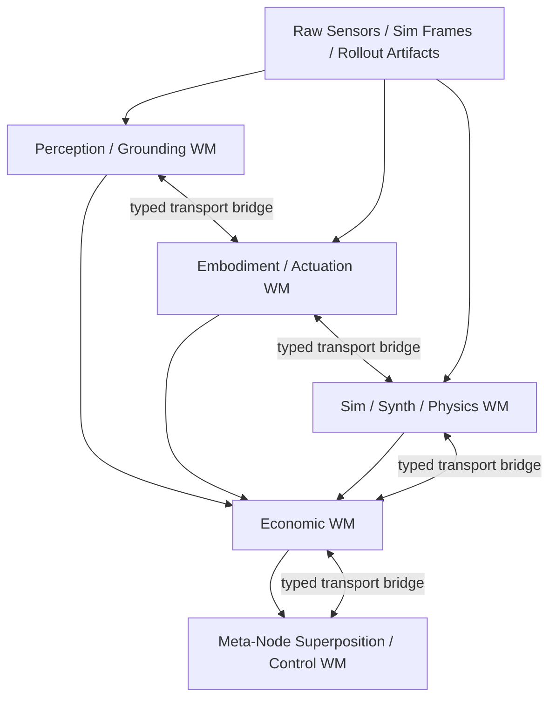

# Multi-WM Architecture Plan

## Purpose

This document defines the next architectural expansion beyond the current semantic-world-model and economic-world-model readiness work.

It is intentionally a plan document, not an implementation pass.

The central question is:

- which world models should exist as canonical state owners
- in what order they should be built
- how they should communicate without collapsing into one giant latent blob
- what should be built next now

## Executive Conclusion

Yes, the proposed topology makes architectural sense, with one important constraint:

- each lower world model must own a canonical, typed, replayable state surface
- the economic world model should sit above those canonical state surfaces
- the meta-node superposition/control world model should sit above the economic world model
- the cross-WM transport layer should be middleware between adjacent world models, not a premature mother-latent that dissolves boundaries

The recommended canonical stack is:

1. Perception / grounding WM
2. Embodiment / actuation WM
3. Sim / synth / physics WM
4. Economic WM over those lower WMs
5. Meta-node superposition / control WM above the economic WM

The recommended next WM to build is:

- **Sim / synth / physics WM**

That is the highest-leverage next step because the current production flywheel gap is less about semantic representation itself and more about what the stack actually decides to simulate, diffuse, synthesize, admit, and feed back into training.

## Architectural Position

### What already exists

The repo already has important canonical-state substrate pieces:

- `RuntimePacket` in `src/runtime/packets.py`
- `EvidenceBus` and `BeliefState` in `src/evidence/bus.py` and `src/evidence/belief_state.py`
- `SemanticWorldModelState` in `src/world_model/semantic_world_model.py`
- semantic selection, orchestration, meta-transformer, queue, sampler, and coverage helper lanes that now emit honest runtime receipts

That means the repo is no longer starting from zero. The missing step is to extend this pattern to additional WMs rather than leaving sim/physics/vision/actuation functionality scattered across scripts, stubs, and helper surfaces.

### What should not happen

Do not:

- build a giant shared latent that replaces typed contracts
- make external OSS models native truth owners
- deeply neuralize the economic WM before lower WMs emit their own canonical state
- treat the meta-node WM as the next immediate task

### What should happen

Do:

- keep frozen OSS models as typed state providers where they are already strong
- make each WM cybernetic and neuralized around canonical state, receipts, and governance
- let the economic WM become the allocator/governor over lower WMs once those lower surfaces are real
- add the transport layer only after at least two adjacent WMs emit stable canonical surfaces

## Topology



Interpretation:

- perception owns canonical scene and grounding state
- embodiment owns canonical body, capability, and control state
- sim/synth/physics owns canonical synthetic branch, physics fidelity, and simulation agenda state
- economic owns pricing, allocation, queueing, value, and governance over the lower states
- meta-node superposition owns cross-WM policy over objectives, Pareto tradeoffs, and governance meta-choice

## Sequencing Rule

The right sequencing is:

1. finish enough lower-WM canonical state so the economic WM has real things to consume
2. consolidate the economic WM over those lower-WM surfaces
3. add the cross-WM transport bridges
4. only then build the meta-node superposition/control WM

So the answer to “should the economic WM be fully stood up first, or should downstream WMs be stood up first?” is:

- the economic WM should continue to be hardened now
- but it should **not** be considered fully neuralized or complete before at least the sim/synth/physics WM and one of perception or embodiment emit canonical state

## Recommended WM Set

### 1. Perception / Grounding WM

Purpose:

- convert raw camera/depth/segmentation/tracking outputs into canonical world state
- own object, geometry, grounding, uncertainty, and scene persistence

Why needed:

- the repo currently has strong ingredients, but still has split ownership across SceneTracks, semantic fusion, map-first, rollout labeling, and vision stubs
- real production needs canonical state, not “vision sidecars plus semantic consumers”

Current anchors:

- `src/vision/scene_ir_tracker/io/scene_tracks_runner.py`
- `src/vision/reconstruction/four_d_reconstruction.py`
- `src/orchestrator/semantic_fusion.py`
- `src/world_model/semantic_world_model.py`
- `src/vla/rollout_labeler.py`

Current gaps:

- `src/vision/backbone_stub.py` is still a literal placeholder
- `src/vla/semantic_vla.py` is still a placeholder analyzer
- SceneTracks real grounding is host-blocked by SAM3D/GPU
- representation ownership is split instead of WM-owned

Disposition:

- this should become an upgraded WM that supersedes and encapsulates the current vision/grounding path rather than living beside it forever

### 2. Embodiment / Actuation WM

Purpose:

- own canonical body state, action semantics, capability envelopes, latency, and physical feasibility
- bridge from task/governance intent to embodiment-feasible action plans

Why needed:

- the repo has embodiment scaffolding, but not a canonical actuation WM
- current action/control assumptions are still mostly fixed-base manipulation assumptions
- future Unitree R1/G1-style control requires body-aware state, not just policy outputs

Current anchors:

- `src/embodiment/core.py`
- `src/embodiment/registry.py`
- `src/runtime/observation_adapter_v2.py`
- `src/runtime/action_adapter_v2.py`
- `src/motor_backend/*`

Current gaps:

- no whole-body embodiment state
- no URDF-driven body contract
- no humanoid locomotion or dexterous hand interface
- no real-time reflex/control separation yet

### 3. Sim / Synth / Physics WM

Purpose:

- own the canonical state for:
  - what should be simulated
  - what should be diffused/generated
  - what synthetic branches should be created
  - which physics backend/fidelity/randomization regime should be used
  - what receipts determine whether branches are valuable, admissible, and training-worthy

Why needed:

- this is currently the thickest flywheel gap
- current logic is improved but still distributed across orchestrator, diffusion, synthetic branch collection, backend shims, and physics stubs

Current anchors:

- `src/orchestrator/semantic_simulation.py`
- `src/orchestrator/diffusion_requests.py`
- `src/evidence/gen2sim_validity.py`
- `scripts/collect_local_synthetic_branches.py`
- `src/envs/physics/*`
- `src/motor_backend/holosoma_backend.py`

Current gaps:

- `src/envs/physics/isaac_backend.py` is still a stub
- parts of the LSD / NAG / GGDS path remain stubby
- agenda ownership is still orchestrator-heavy instead of WM-owned
- diffusion, gen2sim, and synthetic branch generation are not yet owned by one canonical state service

### 4. Economic WM

Purpose:

- value, allocate, schedule, gate, and learn over lower-WM states and receipts

Why it remains central:

- this is the repo’s core identity
- semantic WM is already functioning as one subset feeding toward this layer
- the recent work has made many control-plane helpers real and bounded

What still changes later:

- the economic WM should consume lower canonical WMs more directly instead of leaning on summary proxies
- its future neuralization should condition on lower-WM receipts, not just heuristic planning fields

### 5. Meta-Node Superposition / Control WM

Purpose:

- learn cross-WM governance and Pareto-objective policy over the entire stack
- run counterfactuals over meta-node choices, not only over local task actions

Important clarification:

- there are already local meta-node objects inside the semantic WM and adjacent helper lanes
- this future WM does not replace those local objects
- instead, it becomes the higher-order control layer that conditions, calibrates, and learns over them

Current local meta-node maturity:

- local meta-nodes are real routing/control objects now
- but they are still mostly named bounded-control surfaces with learned layers around them
- they are not yet fully learned geometric/cybernetic objects in their own right

Implication:

- the stack should not jump from today’s bounded local meta-node surfaces directly to an overarching superposition WM
- there needs to be a local meta-node neuralization and robustness tranche first
- that tranche should mature the local meta-node objects themselves before a mother-WM tries to learn over them

Current status:

- not ready to build next
- should remain a later phase after lower WMs and transport layers are real

## Why Sim / Synth / Physics WM Is Next

The current repo is already much farther along on semantic control-plane honesty than it is on self-improvement loop ownership.

The most valuable unresolved question is no longer “can the stack describe semantics?” It is:

- what exact simulation jobs get launched
- what diffusion jobs get requested
- what synthetic branches get created
- how those branches are physics-conditioned
- how outcome receipts come back into replay, training, and economic valuation

This is why the next WM should be sim/synth/physics before a standalone vision WM build-out.

That does **not** mean vision is unimportant. It means:

- the immediate flywheel bottleneck is agenda compilation and synthetic branch governance
- the later perception WM should plug into the sim/synth/physics WM as a provider of grounded state and uncertainty

## Phase Plan

### Phase 0 - Current Baseline and Preconditions

Status:

- largely in progress / partially landed

Objective:

- preserve the current economic-WM readiness work as the substrate for the multi-WM buildout

Already present:

- runtime packet substrate
- evidence bus and belief state
- semantic world-model packet
- event spine / governance / counterfactual / value-target sidecars
- honest helper promotion paths around selection, orchestration, queueing, sampler, fill routing, gen2sim admission, and semantic runtime scorers

Phase gate to start Phase 1:

- keep the current semantic/economic control-plane receipts as the source of truth
- do not reopen frozen Phase B math

### Phase 1 - Sim / Synth / Physics WM

This is the phase to focus on next. It is the only phase described here at near-implementation detail.

### Phase 1 objective

Create a canonical sim/synth/physics WM that consolidates simulation agenda compilation, diffusion conditioning, gen2sim admission context, backend/fidelity selection, and synthetic branch receipts into one governed state surface.

### Phase 1 ownership boundary

This WM should own:

- simulation agenda state
- branch-generation state
- diffusion-conditioning state
- backend and physics fidelity state
- synthetic admission and outcome receipts
- branch-to-training feedback state

This WM should not own:

- raw perception model execution
- whole-body actuation control
- pricing or economic settlement itself
- final meta-node governance policy

### Phase 1 current repo surfaces to absorb

| Current surface | Current problem | Future role under sim/synth/physics WM |
| --- | --- | --- |
| `src/orchestrator/semantic_simulation.py` | mixes selection, agenda, execution setup, and artifact emission | becomes a client of the WM runtime/compiler |
| `src/orchestrator/diffusion_requests.py` | diffusion request logic is adjacent to but not owned by a WM | becomes a diffusion-plan adapter fed by WM state |
| `src/evidence/gen2sim_validity.py` | admission logic exists but is not the sole owner of synth state | becomes one submodule inside WM admission/receipt logic |
| `scripts/collect_local_synthetic_branches.py` | branch generation is script-owned | becomes a WM branch-generation adapter / worker |
| `src/envs/physics/isaac_backend.py` | stub backend with no canonical contract | becomes one backend adapter behind WM backend routing |
| `src/motor_backend/holosoma_backend.py` | backend-specific bridge is outside WM ownership | becomes an execution adapter used by the WM |
| `src/envs/lsd3d_env/ggds.py` and NAG/LSD surfaces | stubby optimization path | becomes an explicit branch renderer/generator provider, not an owner |

### Phase 1 proposed module structure

Recommended additive package:

```text
src/world_model/sim_synth_physics/
  __init__.py
  state.py
  agenda.py
  compiler.py
  backend_router.py
  physics_contracts.py
  diffusion_contracts.py
  synthetic_branches.py
  gen2sim_admission.py
  receipts.py
  calibration.py
  runtime.py
  dataset.py
  training.py
  promotion.py
  adapters/
    semantic_inputs.py
    economic_inputs.py
    embodiment_inputs.py
    backend_pybullet.py
    backend_holosoma.py
    backend_isaac.py
```

Recommended scripts:

```text
scripts/compile_sim_synth_physics_plan.py
scripts/run_sim_synth_physics_loop.py
scripts/train_sim_synth_physics_planner.py
scripts/eval_sim_synth_physics_planner.py
```

### Phase 1 canonical state objects

Recommended typed objects:

- `SimSynthPhysicsWorldState`
  - top-level canonical state for one run/episode/planning window
- `SimulationAgenda`
  - ranked set of simulation jobs to execute
- `SimulationJobSpec`
  - one job with env family, backend, seed, objective preset, coverage targets, and expected receipts
- `PhysicsContextState`
  - fidelity, backend, timestep, randomization, calibration, and safety-relevant physics settings
- `DiffusionConditioningState`
  - governed diffusion request structure, not just a prompt string
- `SyntheticBranchPlan`
  - branch family, gap targets, rendering/generation mode, admission preconditions
- `Gen2SimAdmissionState`
  - explicit branch admissibility context and helper traces
- `SimulationOutcomeReceipt`
  - outcome refs, replay refs, event/debt/governance/value refs, and readiness summary
- `PhysicsCalibrationReceipt`
  - domain-randomization/system-ID summary and backend-quality flags

### Phase 1 input contracts

The WM should consume:

- `BeliefState`
- `SemanticWorldModelState`
- `RuntimePacket`
- coverage-loop outputs
- benchmark-gating signals
- gen2sim validity/admission receipts
- embodiment constraints when available
- economic urgency and value-target summaries

The WM should emit:

- simulation agenda
- diffusion conditioning plan
- synthetic branch plan
- backend/fidelity choice receipt
- branch outcome receipts
- replay-ready artifact refs
- training-feedback refs

### Phase 1 runtime flow

Recommended flow:

1. ingest semantic, economic, and embodiment context through typed adapters
2. compile a `SimSynthPhysicsWorldState`
3. rank simulation jobs and branch jobs inside one agenda
4. choose backend, fidelity, and domain-randomization regime
5. emit a `DiffusionConditioningState` for any render/generation branch
6. execute backend adapters
7. emit `SimulationOutcomeReceipt` and related sidecars
8. feed receipts into replay, benchmark gating, and training datasets

### Phase 1 neuralization plan

Do not start with a giant generative simulator model.

Start with bounded learned helper lanes inside the WM:

- agenda ranking
- backend/fidelity selection
- synthetic branch admission
- branch-value / branch-yield prediction
- physics-calibration confidence prediction

Only after the receipt density is real should the WM expand into:

- learned transition models
- learned synthetic branch proposal models
- v-JEPA-2-style predictive state modules for video-conditioned future estimation

### Where v-JEPA 2 fits

v-JEPA-2-style predictive modeling should be treated as a component inside the future sim/synth/perception stack, not as a separate top-level WM.

Recommended placement:

- later as a predictive latent module that conditions on governed video state, scene tracks, embodiment context, and action plans
- downstream of canonical state
- upstream of render/synthetic branch proposal ranking

### Phase 1 training targets

The first honest training targets for this WM should come from:

- branch evaluations
- value-target packs
- counterfactual evals
- governance traces
- replay outcome receipts
- coverage improvement deltas
- branch yield into later trainer datasets

### Phase 1 acceptance criteria

Phase 1 should count as landed only when:

- simulation agenda ownership is WM-owned rather than spread across orchestrator helpers
- diffusion conditioning is derived from WM state instead of flat prompt assembly alone
- synthetic branch plans are typed objects, not script-local metadata
- backend/fidelity selection is emitted as a first-class receipt
- replay/training consume WM receipts without bespoke joins
- Isaac remains an explicit fallback until a real adapter exists, but it is no longer hidden behind a generic backend name

### Phase 1 explicit gaps

Named gaps that should remain explicit in this phase:

- real Isaac backend implementation
- richer Holosoma integration contract
- domain randomization and system identification policy
- NAG / LSD / GGDS productionization
- real GPU-backed grounded video state for perception-conditioned sim

### Phase 1 OSS dependency posture

Use OSS as providers, not truth owners:

- MuJoCo / dm_control / PyBullet / Isaac for physics execution
- Holosoma where already integrated
- later v-JEPA-2-style predictive modules for future estimation

The WM should own:

- canonical state
- routing
- receipts
- promotion logic
- governance hooks

### Phase 2 - Perception / Grounding WM

Objective:

- turn the current vision, scene-tracks, map-first, teacher-runtime, and grounding path into one canonical perception/grounding WM

Why after Phase 1:

- sim/synth/physics is the tighter current flywheel bottleneck
- this phase should absorb and supersede the current split vision ownership rather than creating yet another parallel vision lane

Phase outcome:

- one canonical scene/grounding state surface feeding semantic, embodiment, and sim WMs

Key named gaps:

- `src/vision/backbone_stub.py`
- `src/vla/semantic_vla.py`
- partial SceneTracks truth still gated by SAM3D host availability
- recap and vision feature builders still contain stub/fallback roots

OSS dependency map:

- segmentation: SAM2
- open-vocab grounding: GroundingDINO
- visual features: DINOv2 or SigLIP
- depth: Depth Anything V2 or UniDepth
- 3D grounding: SAM3D, ConceptGraphs, ScanNet-style baselines

Preconditions:

- Phase 1 receipts must be able to consume richer grounded scene state
- real GPU/SAM3D host needed for promotion-grade grounding

### Phase 3 - Embodiment / Actuation WM

Objective:

- create canonical body/action state for fixed-base and future humanoid/mobile embodiments

Why needed:

- the repo still lacks a real body model for Unitree-class systems
- the current embodiment layer is useful but advisory and manipulation-centric

Phase outcome:

- action feasibility, embodiment capability, latency, and control envelopes become first-class typed state

OSS dependency map:

- whole-body and IK: MuJoCo, Pinocchio, Pink, Drake
- locomotion: legged_gym, walk-these-ways, Unitree RL Gym
- dexterous manipulation: DexGraspNet, IsaacGymEnvs dexterous tasks, HORA
- robot description: Unitree URDFs

Preconditions:

- stable action/observation schema refs
- capability profiles beyond fixed-base workcell assumptions
- initial robot descriptions for target embodiments

### Phase 4 - Deployment Enabler Phases

These are not optional side quests. They are named future phases that must exist before serious embodied deployment.

### Phase 4A - Real-Time Control Loop Separation

Objective:

- separate servo/reflex timescale control from economic/governance timescale control

Reason:

- humanoid or mobile robots need 200-1000 Hz reflex control
- the economic/orchestrator layer should stay slow and deliberative

OSS dependency map:

- `ros2_control`
- MuJoCo
- Unitree SDK2

Preconditions:

- Embodiment / actuation WM with typed action semantics
- target robot control interface

### Phase 4B - Sensor Fusion Shim

Objective:

- build the plumbing from Unitree SDK2 or equivalent raw streams into OSS perception outputs and then into canonical state

Reason:

- somebody has to turn raw cameras, IMU, joint states, and depth into the typed state the WMs consume

OSS dependency map:

- `robot_localization`
- GTSAM
- Kalibr
- Unitree SDK2

Preconditions:

- Perception WM canonical contract
- observation schema with timestamp and proprio support
- access to live sensor streams

### Phase 4C - Physical Safety Layer

Objective:

- add physical safety below the governance/economic layer

Reason:

- economic safety signals are not enough for real robots
- joint limits, self-collision, e-stop, and reflex policies require a separate layer

OSS dependency map:

- `ros2_control`
- `safe-control-gym`
- collision checking from MuJoCo / Drake / Pinocchio stacks

Preconditions:

- embodiment state and robot description
- real-time control loop separation

### Phase 4D - Spatial State / SLAM Integration

Objective:

- support mobile spatial reasoning and navigation state

Reason:

- current repo assumptions are mostly fixed-workcell
- a Unitree-class system needs mapping, localization, and navigation

OSS dependency map:

- ORB-SLAM3
- RTAB-Map
- Nav2

Preconditions:

- perception WM canonical state
- sensor fusion shim
- mobile embodiment target

### Phase 5 - Economic WM Consolidation

Objective:

- make the economic WM consume lower-WM canonical state directly rather than through scattered summaries and heuristic planning fields

This phase is where the current economic-WM work graduates from “strong middleware and bounded helpers” to “real federated world-model governance.”

Key changes in this phase:

- consume `SimSynthPhysicsWorldState`, perception state, and embodiment state directly
- train on lower-WM receipts and cross-WM counterfactuals
- condition meta-transformer and higher planners on lower-WM canonical contracts instead of only derived summary vectors

Preconditions:

- at least two lower WMs emitting stable canonical state
- replay/evidence/value provenance must preserve WM identity explicitly

### Phase 6 - Cross-WM Isomorphic Transport Layer

Objective:

- create learned typed transport bridges between adjacent WMs

This should be middleware, not a mother-WM.

### Transport layer role

Each bridge should:

- translate one WM’s canonical state into the vocabulary of the adjacent WM
- preserve topology where topology matters
- preserve causal structure where causal structure matters
- carry uncertainty and provenance explicitly
- learn from completed loops and postmortem receipts

### Recommended boundary rule

Bridges should operate over typed objects, not raw hidden states.

Examples:

- `BeliefState` -> perception WM state
- perception WM state -> `SemanticWorldModelState`
- `SemanticWorldModelState` -> `SimSynthPhysicsWorldState`
- lower WMs -> economic WM state
- economic WM state -> meta-node control WM state

### Recommended module posture

Recommended additive package:

```text
src/world_model/transport/
  __init__.py
  bridge_contracts.py
  topology_metrics.py
  uncertainty.py
  roundtrip.py
  training.py
  runtime.py
```

### Training rule

Train bridges by freezing adjacent WMs first.

Core decomposed evaluation:

- bridge-only improvement
- downstream-WM-only improvement
- joint improvement
- interaction term

Recommended training signals:

- round-trip reconstruction
- topology preservation
- uncertainty calibration
- downstream economic yield
- governance satisfaction
- postmortem counterfactual improvement

Preconditions:

- at least two adjacent WMs emitting stable canonical state
- replay must preserve WM identity and provenance
- freeze-one-side training scaffold must exist

### Phase 6.5 - Local Meta-Node Neuralization and Robustness

Objective:

- upgrade the existing local meta-node surfaces from named bounded-control objects into more genuinely learned, stateful, cybernetic objects

Why this phase must exist:

- the repo already has local meta-node routing state in the semantic WM and adjacent orchestration layers
- those objects are useful and real, but they are still closer to bounded executor/control surfaces than to learned dynamical objects
- an overarching meta-node superposition WM would be premature if its “atoms” are still mostly hand-named shells with learned wrappers around them

What should improve in this phase:

- local meta-node state should become canonical and replayable rather than mostly summary-like
- local meta-node behavior should train on its own receipts, counterfactuals, and governance outcomes
- local meta-node embeddings should become more geometric/topological and less just named scalar buckets
- meta-node success should be measured independently from downstream loop success where possible
- meta-node interaction effects should be logged, not only final routed actions

Concrete targets for this tranche:

- canonical `MetaNodeState`-style packet surfaces inside the lower WMs
- richer meta-node trajectory and intervention receipts
- counterfactual training targets for:
  - when a meta-node should activate
  - how strongly it should activate
  - which targets it should act on
  - when it should defer or veto
- robustness metrics over:
  - stability under replay shift
  - governance satisfaction
  - calibration
  - interaction consistency with neighboring meta-nodes

Exit criteria:

- local meta-nodes are no longer just bounded named routing shells with learned helpers around them
- they have their own honest training/runtime/promotion story
- the later superposition WM can treat them as mature lower-level objects instead of pseudo-symbolic placeholders

### Phase 7 - Meta-Node Superposition / Control WM

Objective:

- learn the policy over cross-WM governance, objective tradeoffs, and meta-node Pareto control

This is the final mother-layer, not the next layer.

What it should learn over:

- economic WM receipts
- lower-WM readiness and uncertainty
- counterfactual governance outcomes
- meta-node action histories
- cross-WM transport quality

What it should not do:

- directly replace lower WMs
- become a giant hidden-state monolith
- erase local WM contracts or governance traces

Preconditions:

- lower WMs are robust and honest
- economic WM is consuming canonical lower-WM state
- transport bridges are working between adjacent WMs
- local meta-nodes have already passed their own neuralization/robustness tranche and emit canonical state plus trainable receipts
- meta-node actions and governance satisfaction are already logged as trainable receipts

## OSS Dependency Map

| Function | Preferred OSS posture | Role in this architecture |
| --- | --- | --- |
| Segmentation / masks | SAM2 | frozen provider into perception WM |
| Open-vocab grounding | GroundingDINO | frozen provider into perception WM |
| Depth | Depth Anything V2 / UniDepth | frozen provider into perception WM |
| Visual features | DINOv2 or SigLIP | frozen provider into perception WM and recap/selector conditioning |
| 3D grounding | SAM3D / ConceptGraphs | frozen provider into perception WM |
| Physics | MuJoCo / PyBullet / Isaac / Holosoma | execution providers behind sim/synth/physics WM |
| VLA | OpenVLA / Octo / RT-family OSS | external proposal provider, not canonical truth owner |
| Whole-body dynamics / IK | Pinocchio / Pink / Drake | provider into embodiment WM |
| Whole-body / locomotion RL | legged_gym / walk-these-ways / Unitree RL Gym | provider into embodiment WM |
| Safety / low-level control | ros2_control / safe-control-gym | provider below governance layer |
| Sensor fusion | robot_localization / GTSAM / Kalibr | provider into sensor-fusion shim |
| SLAM / nav | ORB-SLAM3 / RTAB-Map / Nav2 | provider into spatial-state phase |

The stack’s differentiator should remain:

- typed canonical state
- governance
- allocation
- valuation
- promotion discipline

not rebuilding every OSS foundation model in-house.

## Stranded Modules and Explicit Future Absorptions

The following existing surfaces should be treated as absorption targets, not permanent architecture:

- `src/vla/semantic_vla.py`
- `src/vision/backbone_stub.py`
- `src/vla/recap_dataset_builder.py`
- `src/envs/physics/isaac_backend.py`
- `src/envs/lsd3d_env/ggds.py`
- `src/vision/spatial_rnn_adapter.py`
- `src/vla/backbones/dummy_backbone.py`

Disposition rule:

- keep them explicit until replaced
- do not let them silently count as canonical state owners

## Decision Summary

The repo should not jump straight from the current semantic/economic stack to a meta-node mother-WM.

The correct next macro-sequence is:

1. build the sim/synth/physics WM
2. build the perception/grounding WM
3. build the embodiment/actuation WM
4. land the real-time, sensor-fusion, safety, and SLAM enabler phases
5. consolidate the economic WM over those lower WMs
6. add cross-WM typed transport bridges
7. neuralize and harden the local meta-node objects themselves
8. build the meta-node superposition/control WM

## Immediate Follow-On Recommendation

For the next implementation tranche after this plan:

- start **Phase 1A and Phase 1B** only
- define the `sim_synth_physics` package structure and state contracts
- move agenda ownership out of scattered orchestrator surfaces and into that canonical WM boundary

That is the cleanest path to make the stack a real self-improvement machine rather than only a better-instrumented control plane.
