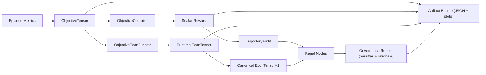

# Objective Tensor Whitepaper

Canonical whitepaper artifacts:
- Markdown: `docs/whitepaper_objective_tensor_stack.md`
- PDF: `docs/whitepaper_objective_tensor_stack.pdf`

## Golden Path Mapping
The runnable golden path that matches the whitepaper loop is:

```bash
python3 scripts/run_golden_path.py --env workcell --episodes 10 --seed 0 --emit artifacts/golden_path
```

It emits:
- Objective tensors (`objective_tensors.jsonl`)
- Compiler scalar rewards (`scalar_rewards.json`)
- Econ deltas (`econ_deltas.json`)
- Regal pass/fail reports with reasons (`governance_report.json`)
- Plot artifacts (`plots/*.png`)

## Contract Boundary Diagram

