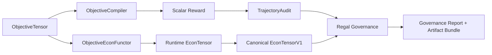

# White Paper: Foundations and Architecture of an Economics-First Robotics Stack

**Date:** February 12, 2026  
**Repository:** `robotics-vp-core`

## Abstract
This paper explains, from first principles, what this robotics system is and why its architecture is designed around economics as a control signal. It then documents what is currently implemented in the codebase, which disciplines it draws from, and how it compares to state-of-the-art (SOTA) systems in each discipline.

The practical thesis is simple: a robot that performs well in simulation but fails unit economics at deployment is not a successful system. This stack therefore treats policy quality, synthetic data generation, and pricing/value telemetry as one connected loop:

`real video -> representation + semantics -> constrained generation -> simulation + policy updates -> objective/economic telemetry -> pricing + data valuation`

---

## 1) Robotics Fundamentals (Before Any Module Names)

### 1.1 What a robotics system must do
At a basic level, any robot stack must solve four problems continuously:

- **Perceive:** estimate state from noisy, partial observations.
- **Decide:** choose actions that improve task progress under uncertainty.
- **Act:** execute with real physical constraints (contacts, friction, latency, drift).
- **Adapt:** improve policy behavior as tasks and environments shift.

### 1.2 Why data is the bottleneck
Modern robot learning is data hungry. Real-world data is expensive, risky, and slow to collect. Synthetic data is cheaper, but can become low-value if it is only visually plausible and not behaviorally transferable.

That creates a core system design problem:

- Generate enough synthetic data to accelerate training.
- Prevent synthetic data from drifting off the real task manifold.

### 1.3 Two common robotics failure modes
This project explicitly targets two structural failures seen in many pipelines:

- **Gen→Sim garbage:** synthetic outputs look good but do not train transferable behavior.
- **Premature scalarization:** complex multi-objective behavior is collapsed too early into one number, losing real tradeoff structure.

---

## 2) Economics Fundamentals (Why Robotics Alone Is Not Enough)

### 2.1 Deployment economics is the real objective
A deployed robot program succeeds only when it creates net economic value for the customer. Conceptually:

`Net value per task-hour = delivered business value - operating cost - failure/risk cost - coordination overhead`

If model quality improves but net value does not, the deployment does not scale.

### 2.2 Why static pricing breaks in robotics
Static pricing assumes performance and risk are stable. Real deployments are not:

- performance varies by environment and task mix,
- safety/error risk varies by context,
- energy costs vary by grid and operating window,
- adaptation/inference compute costs can change over time.

So pricing and valuation must be connected to live performance and uncertainty.

### 2.3 Why customers do not share data by default
Customers often bear data collection burden without immediate benefit. Without explicit economic credit, contribution stalls. A scalable loop therefore needs:

- measurable marginal value of contributed data,
- transparent attribution,
- compensation/credit mechanisms tied to verified gain.

---

## 3) Why Robotics and Economics Must Be Coupled in One Loop

If robotics and economics are separated, the stack optimizes proxy metrics offline and discovers deployment failure late. Coupling them gives a better control loop:

- objective outcomes are measured as structured tensors,
- generation and promotion are constrained by plausibility and governance,
- economic deltas are computed from objective outcomes and uncertainty,
- pricing and data valuation become auditable consequences of behavior.

This is the central architectural idea in this codebase.

---

## 4) What Is Implemented in This Repository

### 4.1 Existing base system (already present)
Core modules already in place before this update include:

- environments and task backends (`src/envs/`),
- RL training entrypoints (`train_sac.py`, `train_ppo.py`),
- reward shaping and controllers (`src/rl/reward_shaping.py`, `src/controllers/`),
- valuation/datapack scaffolding (`src/valuation/`),
- vision/semantic scaffolding (`src/vision/`, `src/vla/`, `src/hrl/`, `src/sima/`).

### 4.2 New objective representation and compile boundary
Implemented modules:

- `src/objectives/schema.py`
- `src/objectives/tensor.py`
- `src/objectives/profile.py`
- `src/objectives/compiler.py`
- `src/objectives/serialization.py`
- `src/objectives/frontier.py`

Exact function:

- objectives are represented as a typed `ObjectiveTensor` (axes + units + normalization + provenance),
- scalar reward is produced only through `ObjectiveCompiler` at explicit boundaries,
- frontier gain is tracked in Pareto terms instead of single-metric heuristics.

### 4.3 New constrained generation manifold
Implemented modules:

- `src/constraints/constraint_set.py`
- `src/orchestrator/diffusion_requests.py`
- `src/diffusion/real_video_diffusion_stub.py`

Exact function:

- `ConstraintSet` is built from semantic evidence + geometry quality/disagreement,
- diffusion requests carry structured constraints and tags,
- generated proposals keep constraint lineage for downstream gating.

### 4.4 New meta-governance layer (regal nodes)
Implemented modules:

- `src/regal/base.py`
- `src/regal/objective_integrity.py`
- `src/regal/reward_safety.py`
- `src/regal/econ_consistency.py`
- `src/regal/gen_plausibility.py`
- `src/regal/data_value.py`

Exact function:

- block hidden early objective collapse,
- detect reward exploit signatures,
- block unsupported positive value claims under violations,
- enforce geometry/semantic plausibility gates,
- promote datapacks by frontier gain times reliability.

### 4.5 New objective–economics coupling and persistence
Implemented modules:

- `src/economics/functor.py` (`ObjectiveEconFunctor`)
- `src/economics/econ_tensor.py` (runtime `EconTensor`)
- `src/logging/episode_logger.py`
- `src/ontology/store.py`
- `src/valuation/datapack_schema.py`
- `src/provenance.py`

Exact function:

- maps objective outcomes + constraint flags + uncertainty to econ deltas,
- persists objective and econ tensor artifacts with lineage,
- keeps legacy scalar/econ paths for compatibility.

### 4.6 Training and sampling integration (no SAC/PPO internals changed)
Implemented modules:

- `src/economics/reward_engine.py`
- `src/policies/unified_quality.py`
- `src/rl/episode_sampling.py`
- entrypoint wiring in `train_sac.py`, `train_ppo.py`, `scripts/train_sac_with_ontology_logging.py`

Exact function:

- RewardEngine can emit `ObjectiveTensor` while still serving scalar reward,
- sampler can scalarize objective slices at explicit boundary,
- algorithm internals remain unchanged.

### 4.7 Reliability hardening completed during merge
- `pyproject.toml`: adds runtime `pydantic>=2` dependency for clean CI environments.
- `src/orchestrator/plan_applier.py`: hardened hot-reload polling for coarse filesystem timestamp resolution (content-hash fallback).

---

## 5) Disciplines Used and Their Role

| Discipline | Role in this stack |
|---|---|
| Robot perception / representation | Generates quality and consistency signals used as constraints and reliability factors. |
| VLA semantics | Provides task/semantic priors that influence generation and governance paths. |
| Generative modeling | Produces synthetic candidates, now conditioned by explicit manifold constraints. |
| RL (SAC/PPO) | Learns policies from scalar rewards compiled from structured objectives. |
| Multi-objective optimization | Keeps tradeoffs explicit until contract-time scalarization. |
| Safety / governance engineering | Uses deterministic gate reports to block/reroute unsafe or untrustworthy artifacts. |
| Economic modeling / valuation | Converts objective outcomes into value deltas, pricing signals, and frontier-aware data ranking. |

---

## 6) End-to-End Functional Walkthrough (Concrete)

Example: fragile manipulation for a customer with constrained energy budget.

- Real video is ingested; semantic and geometry signals are extracted.
- `ConstraintSet` is assembled (safety/affordance/geometry limits).
- Diffusion proposals are generated under this constraint set.
- Plausibility regal gate rejects proposals with high disagreement/low geometry consistency.
- Surviving trajectories produce objective outcomes (`throughput`, `error`, `safety`, `energy`) as `ObjectiveTensor`.
- `ObjectiveCompiler` scalarizes according to the customer profile.
- `ObjectiveEconFunctor` maps outcomes + uncertainty + violations into econ deltas.
- Frontier tracker and data-value gate promote datapacks with positive marginal gain and reliable plausibility.

Result: data generation, learning, and valuation are coupled by explicit, auditable structures rather than hidden heuristics.

### 6.1 Golden Path Command (Exact Entrypoint)
Use this command to run the architecture loop with deterministic artifacts:

```bash
python3 scripts/run_golden_path.py --env workcell --episodes 10 --seed 0 --emit artifacts/golden_path
```

Expected artifact set:
- `objective_tensors.jsonl` (typed objective traces)
- `scalar_rewards.json` (explicit compiler boundary output)
- `econ_deltas.json` (objective->econ deltas)
- `governance_report.json` (regal pass/fail + rationale)
- `artifact_bundle.json` and `plots/*.png` (portable run summary)

Contract boundary diagram:



---

## 7) Comparison to SOTA (Beginner-Friendly)

| Area | Representative SOTA | Relative position of this stack |
|---|---|---|
| VLA robotics | OpenVLA, RT-2, Open X-Embodiment | Strong system-level integration posture (VLA as control-plane input), but not yet full benchmarked production VLA loop across all tasks. |
| Vision foundations | DINOv2-class representation learning | Uses geometry + semantic disagreement as operational constraints; still lacks a single unified learned manifold model benchmarked end-to-end. |
| Generative robotics data | Diffusion Policy, Gen2Sim, Eureka-style reward synthesis | Adds structural conditioning and plausibility gates; diffusion path remains partly stubbed versus full production generators. |
| RL training | PPO, SAC | Preserves stable baselines and adds explicit objective compile boundary; needs broader transfer benchmarks to quantify gains. |
| Multi-objective RL | Pareto-conditioned and constrained RL lines | Strong explicit objective schema and delayed scalarization; needs larger empirical Pareto studies across environments. |
| Data valuation / curation | novelty/risk heuristics in common pipelines | Frontier-based marginal gain + reliability gating implemented; still early versus fleet-scale market-validated valuation systems. |

Key interpretation: this work is strongest as **system architecture and control-plane rigor**, not as a claim of a new best single policy model.

---

## 8) Current Boundaries and Next Technical Steps

What is already true:

- objective tensor and explicit scalarization boundary exist,
- constraint-conditioned generation interface exists,
- governance nodes exist and are integrated in promotion paths,
- objective/econ artifacts persist with provenance.

What remains for full production maturity:

- fully non-stub diffusion and broader real robot loops,
- larger standardized benchmark reporting across task families,
- deeper online pricing/valuation products tied to live deployment contracts,
- broader incident/risk taxonomies for governance nodes.

---

## Conclusion
From a fundamentals view, the core contribution of this stack is not a single model. It is the architecture that keeps robotics learning, synthetic generation, and economics in one coherent, auditable loop.

That is the practical requirement for scaling from "good demos" to economically viable deployment.

---

## References (Primary Sources)

1. OpenVLA paper: https://arxiv.org/abs/2406.09246  
2. OpenVLA project page: https://openvla.github.io/  
3. RT-2 paper: https://arxiv.org/abs/2307.15818  
4. Open X-Embodiment / RT-X: https://arxiv.org/abs/2310.08864  
5. DINOv2: https://arxiv.org/abs/2304.07193  
6. Diffusion Policy: https://arxiv.org/abs/2303.04137  
7. Gen2Sim: https://arxiv.org/abs/2409.10114  
8. Eureka: https://arxiv.org/abs/2310.12931  
9. PPO: https://arxiv.org/abs/1707.06347  
10. SAC: https://arxiv.org/abs/1801.01290  
11. Pareto Conditioned Networks: https://arxiv.org/abs/2009.07749  
12. LIBERO benchmark: https://arxiv.org/abs/2306.03310
