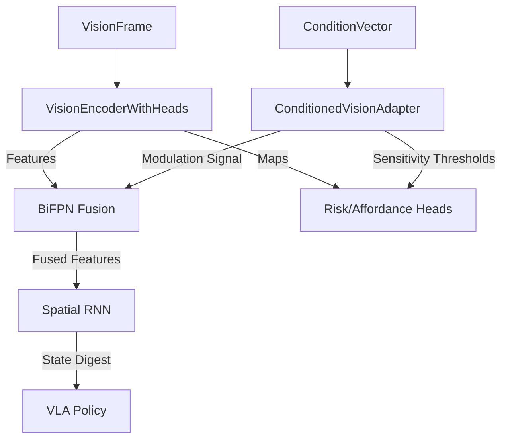

# ObservationAdapter & Vision Fusion Design Pack

**Status**: Draft
**Owner**: Antigravity
**Context**: Unifying Semantic, Economic, and Visual Streams

## 1. Overview

This design defines how the `ObservationAdapter` fuses high-level semantic intent (via `ConditionVector`) with low-level visual perception (`VisionEncoder`). The goal is to create a **semantic-aware vision stack** where the robot "sees" what it "needs" to see based on its economic and task context.

## 2. Architecture

### 2.1. The Fusion Pipeline



### 2.2. Core Components

#### A. `ConditionedVisionAdapter` (New)
Wraps the raw `VisionEncoderWithHeads`.
*   **Input**: `VisionFrame`, `ConditionVector`.
*   **Logic**:
    *   Extracts `z_c` (condition latent) from `ConditionVector`.
    *   Computes modulation parameters $\gamma, \beta$ (scale & shift).
    *   Applies FiLM (Feature-wise Linear Modulation) to visual features.

#### B. Feature Routing Schema
*   **Risk Map Routing**:
    *   If `ConditionVector.risk_tolerance` is HIGH: Dampen `RiskMap` values by 0.5.
    *   If `ConditionVector.skill_mode` == "safety_critical": Amplify `RiskMap` values by 2.0.
*   **Affordance Routing**:
    *   If `ConditionVector.skill_mode` == "precision": Apply "Sharpening" filter to `AffordanceMap`.
    *   If `ConditionVector.skill_mode` == "exploration": Dilate `AffordanceMap` to find loose matches.

#### C. `ObservationAdapter` Updates
The existing `ObservationAdapter` (in `src/observation/adapter.py`) needs to be updated to instantiate and use `ConditionedVisionAdapter` instead of just passing raw frames.

## 3. Invariants & Constraints

### 3.1. The "Blindness" Invariant
> **Invariant**: If `ConditionVector` is missing or invalid, the Vision Stack must default to "Maximum Safety" mode (High Risk Sensitivity, Low Affordance Confidence).

### 3.2. The "SIMA-2 Latent" Invariant
> **Invariant**: The `z_v` (visual latent) produced by the encoder must be **identical** regardless of the `ConditionVector`. Conditioning only affects *downstream* heads and fusion, not the base representation. This ensures the `Datapack` stores a stable visual key.

### 3.3. Physics State Consistency
> **Invariant**: `ObservationAdapter` must verify that `proprioception` timestamps match `vision` timestamps within `dt < 10ms`. Mismatches trigger a `SensorSyncError`.

## 4. Interfaces

### 4.1. `ConditionedVisionAdapter.forward`
```python
def forward(self, image: Tensor, condition: ConditionVector) -> Dict[str, Tensor]:
    # 1. Base Encode (Invariant 3.2)
    base_out = self.encoder(image)
    
    # 2. Compute Modulation
    risk_scale = self._compute_risk_scale(condition.risk_tolerance)
    aff_filter = self._compute_affordance_filter(condition.skill_mode)
    
    # 3. Modulate Heads
    risk_map = base_out['risk_map'] * risk_scale
    aff_map = self._apply_filter(base_out['affordance_map'], aff_filter)
    
    # 4. Fuse
    fused = self.bifpn.fuse(base_out['features'], condition.to_vector())
    
    return {
        "z_v": base_out['z_v'],  # Unchanged
        "risk_map": risk_map,    # Modulated
        "affordance_map": aff_map, # Modulated
        "fused_state": fused
    }
```

## 5. Implementation Plan for Codex

### Phase 1: Adapter Implementation
1.  Create `src/vision/conditioned_adapter.py`.
2.  Implement `ConditionedVisionAdapter` class.
3.  Implement simple scalar modulation (multiplication) first.

### Phase 2: BiFPN Integration
1.  Update `src/vision/bifpn_fusion.py` to accept a `condition_vector` argument.
2.  Implement a simple concatenation or addition of the condition vector to the feature maps before fusion.

### Phase 3: ObservationAdapter Wiring
1.  Modify `src/observation/adapter.py` to accept an optional `vision_adapter` instance.
2.  In `build_observation`, pass the `ConditionVector` (if built) to the `vision_adapter`.

### Phase 4: Verification
1.  Create a test case where `risk_tolerance=High` results in lower values in the output `risk_map` compared to `risk_tolerance=Low`.
