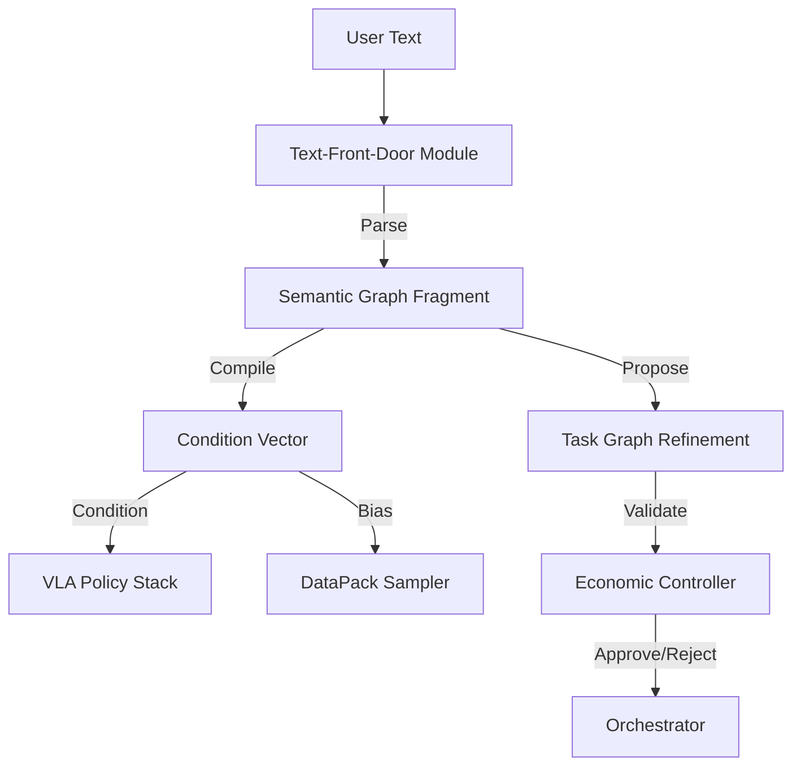

# Text-Front-Door (TFD) Design Pack

**Status**: Draft
**Owner**: Antigravity
**Context**: Natural Language Interface for Robotics-Economics Engine

## 1. Overview

The Text-Front-Door (TFD) is the natural language operator interface for the system. It is **not** just a chatbot; it is a **semantic compiler** that translates unstructured text into structured, economically-weighted directives that drive the underlying VLA (Vision-Language-Action) stack and Economic Engine.

**Core Teleology**:
*   **Text is Capital**: User commands are treated as "orders" in the economic sense—requests for work that carry a price (energy, risk, opportunity cost).
*   **Advisory, Not Imperative**: Text inputs generate *proposals* for the Orchestrator, which accepts or rejects them based on economic viability and safety.

## 2. Architecture

### 2.1. The Pipeline



### 2.2. Components

#### A. `TextOp` (The Operator)
The entry point. Accepts raw text strings and "programs" the system.
*   **Input**: "Clean the kitchen, but be careful with the vase."
*   **Output**: `TextOpPayload` (JSON).

#### B. `SemanticCompiler`
Translates text into the system's ontology.
*   **LLM Backend**: Uses a frozen LLM (e.g., Gemini Pro) to map text to `Ontology` nodes and `ConditionVector` fields.
*   **Output**:
    *   `TargetTask`: "clean_kitchen"
    *   `Constraints`: ["avoid_collision(vase)", "fragility_threshold=0.9"]
    *   `EconBias`: "priority=high"

#### C. `ConditionVector` Integration
TFD writes directly to the `ConditionVector` (which we reviewed in `src/observation/condition_vector.py`).
*   **New Fields**:
    *   `language_goal_embedding`: (Optional) CLIP text embedding of the goal.
    *   `instruction_priority`: float [0..1].
    *   `safety_language_modulation`: float [0..1] (derived from words like "careful", "gentle").

## 3. Detailed Flows

### 3.1. Text → Semantic Graph → Condition Vector
1.  **User**: "Sort the blue blocks, ignore the red ones."
2.  **TFD**:
    *   Identifies Task: `sort_objects`.
    *   Identifies Parameters: `target_color=blue`, `ignore_color=red`.
3.  **Compiler**:
    *   Updates `ConditionVector.objective_vector` to weight "blue" features higher.
    *   Sets `ConditionVector.skill_mode` = "precision_sorting".
4.  **VLA**: Receives the conditioned vector and modulates its attention heads (via FiLM or similar) to focus on blue objects.

### 3.2. Safety + Risk Language Modulation
1.  **User**: "Go fast, I don't care about energy."
2.  **TFD**:
    *   Detects "urgency" keywords.
    *   Sets `ConditionVector.energy_budget_wh` = `INFINITY`.
    *   Sets `ConditionVector.risk_tolerance` = `HIGH`.
3.  **Econ Controller**:
    *   Calculates the *price* of this request. "Going fast increases wear by 50%."
    *   If the user's "account" (or the system's safety bounds) allows it, the command proceeds.
    *   **Safety Override**: If the user says "Run through the wall", the `SafetyPolicy` (sovereign layer) rejects it regardless of TFD output.

### 3.3. Language-Conditioned Frontier Exploration
1.  **User**: "Figure out how to open that weird new latch."
2.  **TFD**:
    *   Sets `ConditionVector.curriculum_phase` = "frontier".
    *   Sets `ConditionVector.novelty_tier` = 2.
3.  **Sampler**:
    *   Starts sampling "latch" related episodes from the `Datapack` store to warm-start the policy.
    *   Activates `SIMA-2` OOD recovery mode.

## 4. Interfaces & Data Structures

### 4.1. `TextOpPayload`
```json
{
  "raw_text": "Clean the kitchen carefully",
  "intent": "clean_area",
  "parameters": {
    "target": "kitchen",
    "modifier": "carefully"
  },
  "semantic_overrides": {
    "risk_level": "low",
    "precision_mode": true
  },
  "econ_bid": {
    "priority": "high",
    "max_energy_cost": 500.0
  }
}
```

### 4.2. `TFDConfig`
```yaml
model: "gemini-1.5-pro"
safety_filter: "strict"
allowed_intents:
  - "pick_place"
  - "navigation"
  - "inspection"
default_priority: "medium"
```

## 5. Implementation Plan for Codex

### Phase 1: Scaffold
1.  Create `src/tfd/` directory.
2.  Implement `TextOp` class (entry point).
3.  Define `TextOpPayload` schema.

### Phase 2: The Compiler (Stubbed)
1.  Implement `SemanticCompiler` with regex/heuristic logic first (no LLM yet).
    *   Map "careful" -> `risk_level=low`.
    *   Map "fast" -> `speed=high`.
2.  Connect `SemanticCompiler` to `ConditionVectorBuilder`.

### Phase 3: Integration
1.  Update `run_stage2_sima2_pipeline.py` to accept an optional `--instruction` argument.
2.  Verify that text input changes the generated `ConditionVector`.

### Phase 4: LLM Connection (Future)
1.  Replace heuristic compiler with `LLMCompiler` using the `google-generativeai` library.
